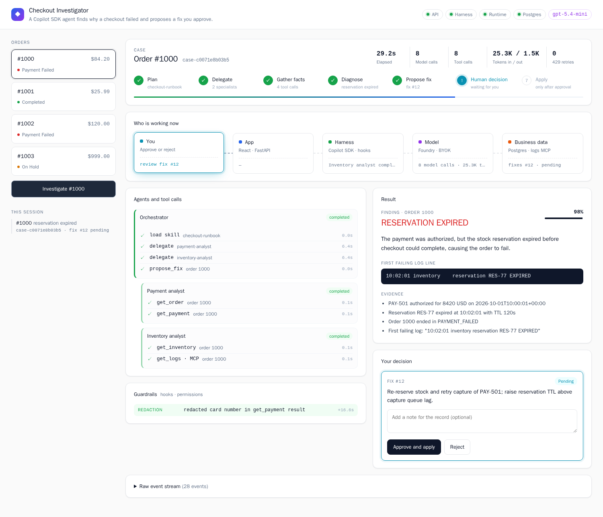
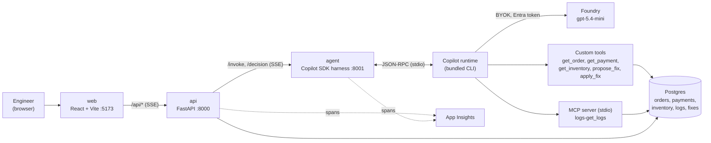
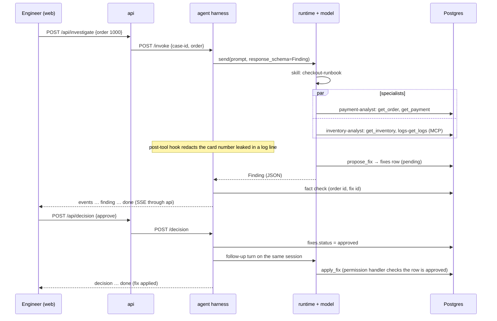

# Capstone: Checkout Investigator

Code: [`lessons/capstone/`](../lessons/capstone/) · How to run: [capstone README](../lessons/capstone/README.md) · Issues log: [issues-changes-fixes.md](issues-changes-fixes.md)

## 1. Story (simple)

A customer's checkout for order 1000 failed. A support engineer opens the Checkout Investigator.

1. The engineer picks the order and clicks **Investigate**.
2. The agent reads its **runbook** (a skill).
3. It sends two **specialists** (sub-agents) to collect facts in parallel. One checks the order and payment. The other checks the stock reservation and the logs.
4. **Guardrails** (hooks) watch every tool call. They keep the tools on this order and hide card numbers.
5. The agent writes a **structured finding** with evidence. It also stores **one proposed fix** in the database as `pending`.
6. The engineer **approves or rejects** the fix. Only after an approval can the agent apply it.

Rule: **the agent finds and proposes. A human decides. The database is the record.**

## 2. Big picture: one request, step by step

1. **Browser → web.** React shows the orders. The engineer clicks Investigate.
2. **web → api.** `POST /api/investigate` opens a stream (Server-Sent Events).
3. **api → agent.** The API makes a new case id (`case-<hex>`) and calls `POST /invoke`. It sends the agent's stream back to the browser unchanged.
4. **agent → Copilot runtime.** The harness creates one SDK session per case. The session id is the case id.
5. **runtime → Foundry model.** BYOK: the model is `gpt-5.4-mini` on our Foundry resource. The token comes from your `az login`.
6. **runtime → tools.** Custom tools read Postgres as a read-only user. Logs come from a local MCP server.
7. **hooks.** Every tool call passes the permission handler and the pre-tool and post-tool hooks.
8. **finding.** The last reply must match the `Finding` schema. The harness then checks its facts against the database.
9. **decision.** Approve or Reject is a **second turn** on the same session (`POST /api/decision`).
10. **telemetry.** The API and the agent send spans to App Insights under one operation id.

## 3. Architecture

Four containers run in Docker Compose: `web`, `api`, `agent` and `db`. The only remote call is the model.

## 4. One investigation, then an approval

## 5. Lessons → capstone

| Lesson | Where it is used | File |
|---|---|---|
| 1 Getting started | One `CopilotClient` for the whole service; `ping` in `/health` | [harness.py](../lessons/capstone/agent/app/harness.py), [main.py](../lessons/capstone/agent/app/main.py) |
| 2 Session persistence | Session id = case id; `get_session_metadata` + `resume_session` for the decision turn; `delete_session` when the case closes | [harness.py](../lessons/capstone/agent/app/harness.py) |
| 3 Streaming events | `session.on` → small JSON events → SSE (agent → api → web) | [harness.py](../lessons/capstone/agent/app/harness.py), [sse.ts](../lessons/capstone/web/src/sse.ts) |
| 4 Context management | System message (append mode); infinite sessions with background compaction at 80% | [harness.py](../lessons/capstone/agent/app/harness.py) |
| 5 Auth + BYOK | `provider` type `openai` with a bearer token from `AzureCliCredential`; no GitHub login | [harness.py](../lessons/capstone/agent/app/harness.py) |
| 6 Permissions + tool hooks | Scope guard (pre-tool), card redaction (post-tool), permission handler for the fix tools | [hooks.py](../lessons/capstone/agent/app/hooks.py) |
| 7 Custom tools | Read tools skip permission; `propose_fix` and `apply_fix` write to the `fixes` table | [tools.py](../lessons/capstone/agent/app/tools.py) |
| 8 Custom agents | `payment-analyst` and `inventory-analyst`, each limited to its own tools | [harness.py](../lessons/capstone/agent/app/harness.py) |
| 9 MCP servers | stdio `logs` server built with `MCPServer` | [logs_mcp_server.py](../lessons/capstone/agent/app/logs_mcp_server.py) |
| 10 Observability + scaling | OpenTelemetry → App Insights; `/health` on every service; error events; usage per turn | [telemetry.py](../lessons/capstone/agent/app/telemetry.py) |
| 11 Steering + queueing | Not used. One turn per case at a time (per-case lock) | — |
| 12 User input + structured output | `response_schema=Finding`; approval is a follow-up turn, not `ask_user` | [tools.py](../lessons/capstone/agent/app/tools.py) |
| 13 Skills + lifecycle hooks | `checkout-runbook` skill, prompt hook adds case context, stop gate, session limits, client info | [SKILL.md](../lessons/capstone/agent/app/skills/checkout-runbook/SKILL.md), [hooks.py](../lessons/capstone/agent/app/hooks.py) |

## 6. Guardrails

Each guardrail is enforced in code. The model does not have to cooperate.

| Guardrail | SDK mechanism | What it does |
|---|---|---|
| Tool allow-list | `available_tools` | The model sees only `task`, `skill`, the 5 custom tools and `logs-get_logs`. It has no shell and no file tools. |
| Read-only data | DB roles | Read tools connect as `app_ro`. Only the fix tools use `app_rw`, and that role can only write `fixes`. |
| Safe tool output | tool code | `get_payment` returns only `**** 1111`. The full card never leaves the database through a tool. |
| Scope guard | `on_pre_tool_use` | Denies a tool call for any order other than the case's order. |
| Redaction | `on_post_tool_use` | Defense in depth: a payment-gateway **log line** leaks the full card. The hook changes it to `**** 1111` before the model sees it. |
| Propose, never apply | permission handler | `propose_fix` is approved. `apply_fix` is approved only if the DB row is `approved` for this case. |
| Stop gate | `on_agent_stop` | Blocks the main agent once if it tries to stop without `propose_fix`. Skipped while sub-agents run. |
| Fact check | harness code | The finding's order id must match the case, and its fix id must belong to the case. |
| One turn per case | `asyncio.Lock` per case | A second request on a busy case gets an error. Nothing is reset or written. |
| Case cleanup | `delete_session` | When every fix of a case is applied or rejected, the session is deleted. A sweeper deletes cases idle for 24h (`SESSION_TTL_H`). The `fixes` table keeps the record. |
| Secrets | Compose secrets | DB passwords are random files in `secrets/` (git-ignored), mounted at `/run/secrets`. They do not show in `docker inspect`. |
| Abort on disconnect | `session.abort()` | If the browser goes away, the runtime stops the turn and stops spending tokens. |

## 7. API map

| Endpoint | Service | Body | Reply |
|---|---|---|---|
| `GET /api/health` | api | — | `{status, db, agent: {status, db, runtime}}` |
| `GET /api/orders` | api | — | orders list |
| `GET /api/fixes?conversation_id=` | api | — | fixes for a case |
| `POST /api/investigate` | api → agent `/invoke` | `{order_id}` | SSE events |
| `POST /api/decision` | api → agent `/decision` | `{conversation_id, fix_id, approve, note}` | SSE events |

Each stream event is one `data:` line holding JSON with a `type` field:

| `type` | When |
|---|---|
| `conversation` | First event (sent by the api): the case id |
| `turn_start` | A turn begins (`investigate` or `decision`) |
| `skill`, `subagent`, `tool_start`, `tool_done`, `intent`, `compaction` | Mapped from SDK session events |
| `hook` | A guardrail or lifecycle hook fired |
| `decision` | The human decision was saved |
| `finding` | The structured result |
| `message` | Plain reply text (for example, after a decision) |
| `error` | Error or failed fact check |
| `done` | Last event: usage (tokens, model calls, time) and the case's fixes |

## 8. Observed output (2026-10-04, after the TPM increase)

| Run | Result | Model calls | Tokens in / out | Time |
|---|---|---|---|---|
| Order 1000 investigate | `RESERVATION_EXPIRED`, 98% confidence, fix #12 pending, card redacted | 8 | 25.3K / 1.5K | 29 s, 0 retries |
| Order 1000 approve | `apply_fix` → fix #12 `applied` | 2 | about 11K total | — |
| Order 1001 investigate | `NO_FAILURE`, no fix | 8 | 25.1K / 1.4K | — |
| Order 1002 investigate + reject | `CARD_DECLINED`, fix #7 `rejected` with the note saved | — | — | — |

Before the increase (10K TPM), the same investigation took 60–140 s because of 429 retries.

App Insights: one `operation_Id` holds both `checkout-api` and `checkout-agent` spans: `POST /api/investigate` → `POST /invoke` → `invoke_agent investigate` → `execute_tool skill / task / get_order / get_payment / get_inventory / logs-get_logs / propose_fix` → `SELECT`.

## 9. Gotchas (details in the [issues log](issues-changes-fixes.md))

1. **Package mirror.** Containers here cannot reach public PyPI or npm. Use the Microsoft feeds. The SDK 1.0.16 wheel is not on the mirror; `fetch_wheels.sh` downloads it.
2. **`on_agent_stop` fires for sub-agents too.** Track running sub-agents and skip the stop gate while any run.
3. **Cancelling a Python task does not stop the runtime.** Call `session.abort()`.
4. **The permission handler runs before the tool.** Record success in the post-tool hook.
5. **A schema checks shape, not facts.** Check ids against the database.
6. **`ping` replies `"pong: <message>"`.**
7. **Named volumes take the image directory's owner.** Create `/home/app/.copilot` as the app user in the Dockerfile.
8. **BYOK needs a reasoning model.** The runtime always sends a reasoning effort.
9. **Token rate.** One investigation uses about 25K input tokens. Plan TPM for your number of parallel cases.
10. **Sync tool handlers block the event loop.** The SDK calls a sync handler directly. Make tools `async` and run blocking DB calls with `asyncio.to_thread`.
11. **Postgres init scripts run once.** A `db-roles` step syncs app passwords on every `up`. Its healthcheck must use TCP: during first-start init, Postgres listens on the socket only.

## 10. Accepted limits and what comes next

- Local lab only. One agent process; in-memory locks.
- The superuser password is set once. Changing it needs `docker compose down -v`.
- The card data is fake seed data.
- **Next:** move `agent` to a Foundry Hosted Agent. Try the [background features](sdk-concepts.md#5-revisit-before-the-capstone) and the SDK 1.0.17 upgrade (sub-agent hooks would replace the stop-gate workaround).
