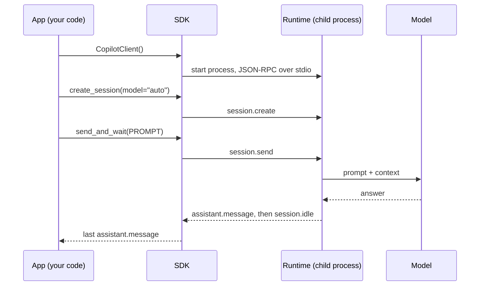

# Lesson 1: Getting started (one turn, end to end)

Code: [`lessons/lesson_01_getting_started.py`](../../lessons/lesson_01_getting_started.py)
Run: `uv run python lessons/lesson_01_getting_started.py`
Big picture first: [Architecture](../sdk-architecture.md)

## 1. Story (simple)

1. **The App starts a client.** The SDK starts the Copilot runtime as a child process and talks JSON-RPC to it.
2. **The App creates a session.** The runtime creates one conversation and its workspace on disk.
3. **The App sends one prompt.** The runtime runs the agent loop and calls the model.
4. **The App gets the reply.** `send_and_wait` returns when the runtime reports `session.idle`.

Rule: **client → session → send → reply.**

## 2. One turn



## 3. Who owns what

| Layer | Owns | In this lesson |
|---|---|---|
| App | Business truth, the prompt | `PROMPT`, `main()` |
| SDK | Typed API, process start, JSON-RPC | `CopilotClient`, `create_session`, `send_and_wait` |
| Runtime (harness) | Agent loop, context, workspace, tools | Started by the SDK |
| Model | Text in, text out; stateless | Picked by `model="auto"` |

## 4. API map

| Goal | Code |
|---|---|
| Start and stop the runtime | `async with CopilotClient() as client:` |
| New conversation | `async with await client.create_session(model="auto") as session:` |
| One turn, wait for the end | `reply = await session.send_and_wait(prompt)` |
| Read the answer | `reply.data.content` (check `reply is None` first) |

## 5. What we observed

```text
A Copilot SDK session includes the harness state that runs the agent loop, provides tools, and applies
permissions-not just a transcript. The model only sees the context the harness sends, while the App
retains business truth and ownership.
```

Gotchas:

- `send_and_wait` returns `None` when a turn ends without an assistant message (for example, aborted). Always check it.
- Leaving the session `async with` block disconnects the session. Its state stays on disk (Lesson 2).

## 6. Map to the Order 1000 scenario (Foundry Hosted Agent)

| Scenario step | Lesson 1 piece |
|---|---|
| The hosted agent container starts | `CopilotClient()` starts the runtime in the VM |
| A support case opens | `create_session` |
| "Why did checkout fail for order 1000?" | `send_and_wait` |
| The App shows the answer | `reply.data.content` |

## 7. Remember

- The SDK is a thin typed client. The runtime does the agent work.
- One client can hold many sessions.
- A turn ends at `session.idle`, not at the first message.
- The model sees only what the runtime sends.

## 8. Try it (one safe extension)

Change `PROMPT` to ask two questions and print `reply.data.content` length. Then set `model` to a specific model from `/model` and compare the answer.
