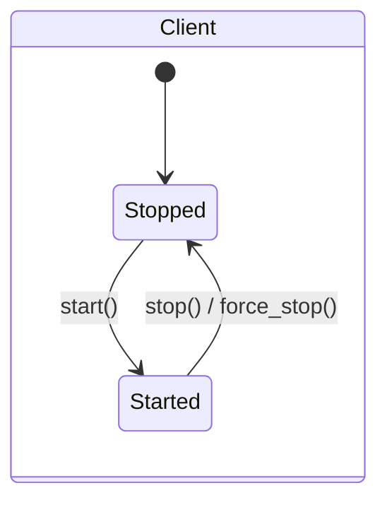
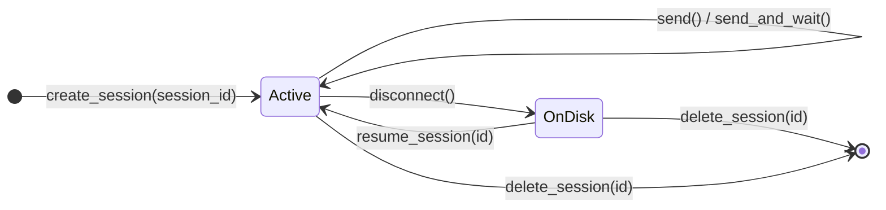

# Lesson 2: Session persistence (client + session lifecycle)

Code: [`lessons/lesson_02_session_persistence.py`](../../lessons/lesson_02_session_persistence.py)
Run: `uv run python lessons/lesson_02_session_persistence.py`

## 1. Story (simple)

1. The **client** starts the runtime process. It is a phone line.
2. A **session** is one conversation (one case, e.g. Order 1000). It is a folder on disk.
3. You can hang up the phone (`disconnect`, `stop`). The folder stays.
4. A new phone line (new client) can open the same folder (`resume_session`). History comes back.
5. `delete_session` removes the folder. The case is closed.

Rule: **the process is temporary. The session folder is durable.**

## 2. Two lifecycles





| State | In memory (handle + handlers) | On disk (`~/.copilot/session-state/<id>`) |
|---|---|---|
| Active | yes | yes |
| OnDisk (disconnected) | no | yes |
| Deleted | no | no |

## 3. API map

| Step | Call | Notes |
|---|---|---|
| Start | `CopilotClient()` + `await client.start()` (or `async with`) | Spawns the runtime (JSON-RPC over stdio) |
| Check | `get_status()`, `ping()`, `get_auth_status()`, `list_models()` | Health + auth |
| Watch | `client.on_lifecycle(handler)` | `session.created`, `session.updated`, `session.deleted`, ... |
| Create | `create_session(session_id=..., model=..., on_permission_request=...)` | Pick your own id (e.g. `case-1000`) so you can find it later |
| Where | `session.session_id`, `session.workspace_path` | Workspace = session folder |
| Pause | `await session.disconnect()` | Frees handlers. Keeps history on disk. Old handle is unusable |
| Find | `list_sessions()`, `get_session_metadata(id)`, `get_last_session_id()` | Metadata is `None` if missing |
| Resume | `resume_session(id, on_permission_request=...)` | Re-register handlers + tools. They are not stored on disk |
| Remove | `delete_session(id)` | Deletes the folder |
| Stop | `await client.stop()` | Ends the runtime process |

## 4. What we observed

```text
[2] workspace on disk: ~/.copilot/session-state/lesson2-case-89afe8a0
[3] assistant: noted.
[4] client 1 stopped. Runtime process is gone. Files stay on disk.
[5] session found on disk: True
    assistant: EXPIRED-RESERVATION      <- new process, same memory
[6] metadata after delete: None
    workspace folder exists: False
```

## 5. Map to the Order 1000 scenario (Foundry Hosted Agent)

| Scenario moment | Lifecycle call |
|---|---|
| Case opens, VM starts | `start()` + `create_session(session_id="case-1000")` |
| Agent investigates | `send()` turns |
| Waiting for human approval, VM goes idle | `disconnect()` + `stop()`; folder stays in `$HOME` |
| Approver decides, VM resumes | new client + `resume_session("case-1000")` |
| Case closed | `delete_session("case-1000")` (or keep for audit) |

## 6. Remember

- One client → many sessions. Session id = your business key.
- `disconnect` ≠ `delete`. Disconnect keeps the disk. Delete removes it.
- Handlers (permissions, tools, hooks) live in your process. Pass them again on resume.
- In a hosted VM, keep `~/.copilot` under persistent `$HOME`, or resume fails after idle.

## 7. Try it (one safe extension)

Comment out step 6, run the script, then run `ls ~/.copilot/session-state/`. The folder is still there.
Then delete it with a short script that calls `delete_session`.
