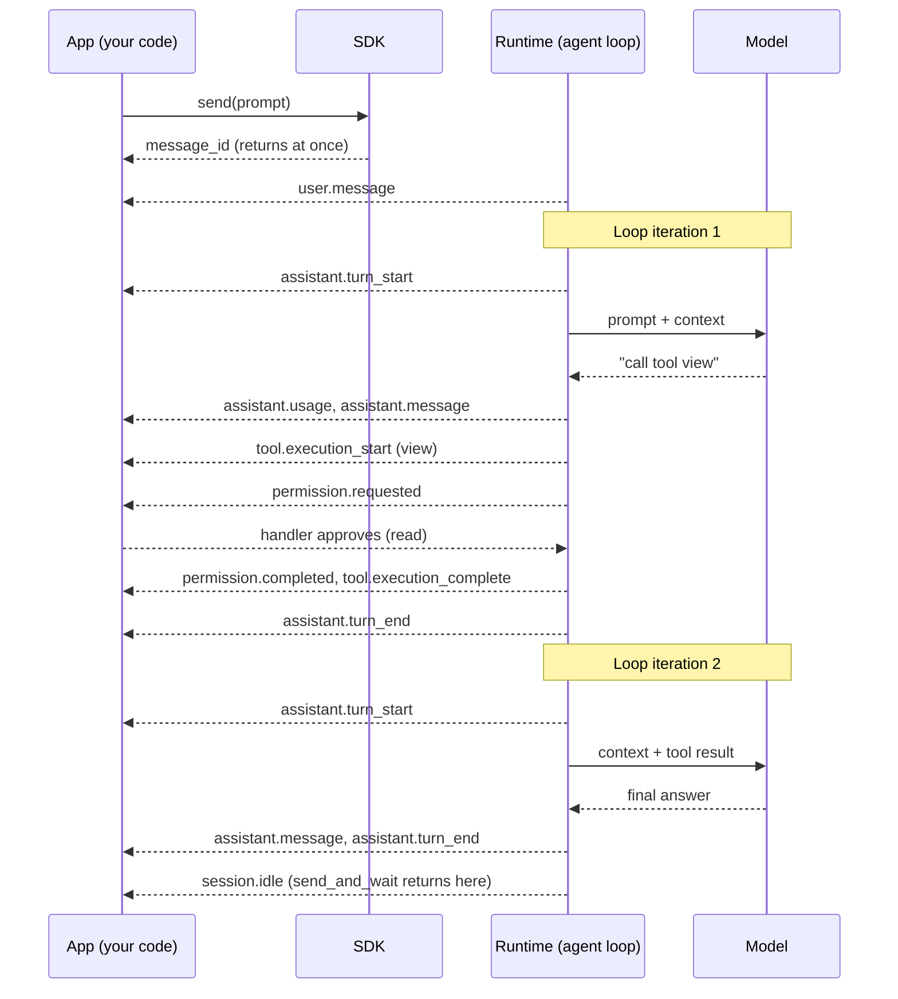

# Lesson 3: Streaming events

Code: [`lessons/lesson_03_streaming_events.py`](../../lessons/lesson_03_streaming_events.py)
Run: `uv run python lessons/lesson_03_streaming_events.py`

## 1. Story (simple)

1. You send one message. `send()` returns **at once**. It gives you a message id, not the answer.
2. The runtime works. It reports **every step** as an event: model call, tool call, permission, answer.
3. The SDK passes each event to every handler you added with `session.on(handler)`.
4. When the work is done, the runtime emits `session.idle`. `send_and_wait()` simply waits for that event.
5. With `streaming=True`, the answer also arrives in small pieces (`assistant.message_delta`) before the full `assistant.message`.

Rule: **events are the only window into the agent. Your app shows progress by listening to them.**

## 2. One turn, one diagram (from our real run)



## 3. Event families

| Family | Examples | Use it for |
|---|---|---|
| Input | `user.message` | Audit what was asked |
| Loop | `assistant.turn_start` / `turn_end` | Count loop iterations; progress UI |
| Output | `assistant.message`, `assistant.message_delta` | Show the answer (full or streamed) |
| Tools | `tool.execution_start` / `complete` | Show "running X..."; audit tool use |
| Approval | `permission.requested` / `completed` | Human or policy gates (Lesson 6) |
| Cost | `assistant.usage` | Tokens, model, cost |
| End / fail | `session.idle`, `session.error` | Turn done; error handling |
| Housekeeping | MCP status, `session.tools_updated`, ... | Usually ignore |

## 4. Envelope

Every event has the same shape. Match on `event.data` (typed) or `event.type` (enum).

| Field | Meaning |
|---|---|
| `type` | `SessionEventType`, e.g. `tool.execution_start` |
| `data` | Typed payload, e.g. `ToolExecutionStartData(tool_name="view", ...)` |
| `id`, `parent_id`, `timestamp` | Order and links between events |
| `ephemeral` | `True` = live only, **not** saved to history (deltas, usage, idle) |
| `agent_id` | Set when a sub-agent sent the event |

## 5. What we observed

```text
A. 38 delta events -> one final message of 145 chars
B. send() returned at once: message_id=84f7...
   2 x assistant.turn_start          <- agent loop ran twice (call tool, then answer)
   tool=view, permission approved, success=True
   68 live events total, 14 core
   15 stored in history               <- ephemeral events are not stored
   in=27387 tokens for a tiny prompt  <- system prompt + tool definitions (Lesson 4: context)
```

## 6. Map to the Order 1000 scenario

| Scenario moment | Event the App listens for |
|---|---|
| Show "agent is working" | `assistant.turn_start` |
| Show "fetching order / payment / logs" | `tool.execution_start` (`tool_name`) |
| Stream the conclusion to the UI | `assistant.message_delta` |
| Gate a risky tool | `permission.requested` (harness handler decides) |
| Track cost per case | `assistant.usage` |
| Mark the step done; save case state | `session.idle` |
| Alert on failure | `session.error` |

## 7. Remember

- `send()` = fire and forget. `send_and_wait()` = `send()` + wait for `session.idle`.
- `session.on(handler)` returns an `unsubscribe` function.
- Streaming is opt-in: `streaming=True`. You still get the final `assistant.message`.
- Ephemeral events are live only. `get_events()` returns the stored history.
- One user message can cause many loop iterations (`assistant.turn_start`).

## 8. Try it (one safe extension)

In Part B, remove the `if kind not in CORE_EVENTS: return` line and run again. You will see all ~68 events. Name 3 you would show in a UI and 3 you would ignore.
