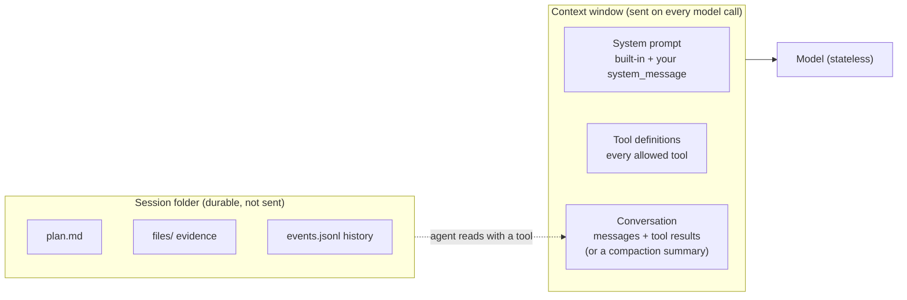

# Lesson 4: Context management

Code: [`lessons/lesson_04_context_management.py`](../../lessons/lesson_04_context_management.py)
Run: `uv run python lessons/lesson_04_context_management.py`

## 1. Story (simple)

1. The model has **no memory**. On every call, the runtime sends it a fresh package: the **context window**.
2. The package has 3 parts: **system prompt** + **tool definitions** + **conversation**.
3. Each turn makes the conversation part bigger. Near the limit, the runtime **compacts**: it replaces old turns with a summary.
4. Some state lives **outside** the package, in the session folder: `plan.md`, files, the event history. It is durable. The model sees it only if the agent reads it.

Rule: **context is what the model sees now. State is what survives. Keep the context small and the state durable.**

## 2. What goes into one model call



## 3. Where state lives

| Layer | Where | Lifetime | Who controls |
|---|---|---|---|
| Context window | Built per model call | One call | Runtime (from config + history) |
| Conversation history | Session folder `events.jsonl` | Until `delete_session` | Runtime; compacted near limit |
| Workspace state | Session folder `plan.md`, files | Until `delete_session` | Agent (tools) or app (`session.rpc.plan` / `workspaces`) |
| Memory (cross-session) | Runtime-managed, outside the session folder | Across sessions | `memory={"enabled": ...}` |
| Business state | Your app DB | Forever | App (not the SDK) |

## 4. API map

| Goal | Call |
|---|---|
| See context size | Event `session.usage_info`: `system_tokens`, `tool_definitions_tokens`, `conversation_tokens`, `current_tokens`, `token_limit` |
| Fewer tools | `available_tools=[...]` (allow-list) or `excluded_tools=[...]` |
| Your instructions | `system_message={"mode": "append", "content": ...}` (also `customize` per section, `replace` = removes guardrails) |
| Auto compaction | `infinite_sessions={"enabled": True, "background_compaction_threshold": 0.80, "buffer_exhaustion_threshold": 0.95}` (default on) |
| Manual compaction | `await session.rpc.history.compact(SessionHistoryCompactRequest(custom_instructions=...))` |
| Big tool output | `large_output={"max_size_bytes": ...}`: written to a file, model gets a reference |
| Plan | `session.rpc.plan.update(PlanUpdateRequest(content=...))`, `plan.read()` |
| Files | `session.rpc.workspaces.create_file(...)`, `list_files()`, `read_file(...)` |

## 5. What we observed

```text
A. default  system=5481 tools=27472 conversation=34   total=32987 / 272000 (12.1%)
B. lean     system=3048 tools=0     conversation=54   total=3102           (1.1%)
            conversation grows per turn: 54 -> 117 -> 179
C. compact  messages_removed=5 tokens_removed=-268   <- tiny history: summary is bigger!
            recall after compaction: all 3 facts correct
D. files    plan.md + evidence/facts.txt in the session folder
```

Lessons from the numbers:
- **Tool definitions were 83% of the default context.** Restricting tools is the biggest saving.
- Compaction pays off only for long histories. Use `custom_instructions` to protect key facts.
- Facts you must not lose belong in **workspace files** (or the app DB), not only in the conversation.

## 6. Map to the Order 1000 scenario

| Scenario need | Context / state choice |
|---|---|
| Investigator needs only order, payment and log tools | `available_tools=[...]`: small, focused context |
| Case role + rules | `system_message` append |
| Long log analysis | `large_output` + infinite sessions (auto compaction) |
| Evidence and plan | `plan.md` + `evidence/` files in the workspace (`$HOME` in the VM) |
| Decision + approval status | App DB (business state), not the session |

## 7. Remember

- Model = stateless. The runtime rebuilds the context on every call.
- Context = system + tools + conversation. Tools are often the biggest part.
- Compaction = summary replaces old turns. Lossy. Protect facts with instructions or files.
- Workspace = durable and outside the context. It survives compaction, disconnect and resume.

## 8. Try it (one safe extension)

Set `available_tools=["view"]` in Part B. Run again. Compare `tools=` with 0 and with 27472.
