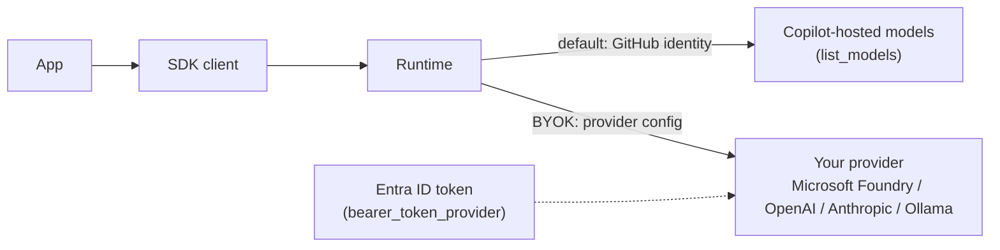

# Lesson 5: Authentication + BYOK (models)

Code: [`lessons/lesson_05_auth_and_byok.py`](../../lessons/lesson_05_auth_and_byok.py)
Run: `uv run python lessons/lesson_05_auth_and_byok.py`

## 1. Story (simple)

1. **Auth answers "who is calling?"** The client signs in once with a GitHub identity. Sessions inherit it.
2. **The identity decides which models you may use.** `list_models()` shows them, with limits and policy.
3. **Each session picks a model.** `"auto"` lets the runtime choose per call. You can switch mid-session; history stays.
4. **BYOK ("bring your own key") changes where inference goes.** With a `provider`, the runtime calls *your* endpoint (for example Microsoft Foundry). Billing and data stay with your resource.

Rule: **auth = identity. model = brain. provider = whose brain and whose bill.**

## 2. Two paths to a model



## 3. Auth priority (highest first)

| # | Source | Typical use |
|---|---|---|
| 1 | `CopilotClient(github_token=...)` or per-session `github_token` | Server, multi-user apps |
| 2 | `GITHUB_COPILOT_API_TOKEN` + `COPILOT_API_URL` | Direct API token |
| 3 | `COPILOT_GITHUB_TOKEN` → `GH_TOKEN` → `GITHUB_TOKEN` | CI, containers |
| 4 | Stored `copilot` CLI login | Local dev (this lab) |
| 5 | `gh auth` credentials | Local dev fallback |

Check it: `await client.get_auth_status()` → `isAuthenticated`, `authType`, `login`.

## 4. API map

| Goal | Call |
|---|---|
| Who am I | `client.get_auth_status()` |
| What models | `client.list_models()` → `id`, `capabilities.limits.max_context_window_tokens`, `policy.state`, `supported_reasoning_efforts`, `billing.token_prices` |
| Pick a model | `create_session(model="claude-haiku-4.5", reasoning_effort="low")` |
| Switch model | `await session.set_model("...")`: history is kept |
| Which model really ran | Event `assistant.usage` → `data.model` (important with `"auto"`) |
| BYOK | `create_session(model=<deployment>, provider={...})` |

BYOK `provider` fields (Foundry):

| Field | Value |
|---|---|
| `type` | `"openai"` for `https://<res>.openai.azure.com/openai/v1/`; `"azure"` for native Azure routes |
| `base_url` | Your endpoint |
| `wire_api` | `"responses"` (new models) or `"completions"` |
| Auth | `bearer_token_provider` (Entra ID; best) > `bearer_token` > `api_key` |
| `wire_model` | Deployment name if different from `model` |
| Model choice | Must be a reasoning model (gpt-5.x / o-series); see the gotcha below |

## 5. What we observed

```text
A. authenticated=True type=user login=ppenumatsa_microsoft
B. 24 models; e.g. claude-haiku-4.5 context=200000 reasoning=None
                    gpt-6-luna      context=1000000 reasoning=[none..max]
C. [auto]             -> assistant.usage model = gpt-6-luna
   [claude-haiku-4.5] -> same session, after set_model
D. BYOK, live, Microsoft Foundry (cog-clpttynzwwraw), Entra ID user token, no API key:
   [foundry:gpt-5.4-mini] I'm powered by the GPT-5.4 family.
   assistant.usage models: ['gpt-5.4-mini']
```

Run Part D yourself:

```bash
az login
export FOUNDRY_BASE_URL=https://cog-clpttynzwwraw.openai.azure.com/openai/v1/
export FOUNDRY_MODEL=gpt-5.4-mini
uv run python lessons/lesson_05_auth_and_byok.py
```

Your identity needs the *Cognitive Services OpenAI User* role on the resource.

Gotcha found live: **the runtime always sends a reasoning effort** (`reasoning.effort` or `reasoning_effort`, default `medium`). A non-reasoning deployment such as `gpt-4.1-mini` returns HTTP 400 on both wire APIs. A `model_capabilities` override and `provider.model_id` did not stop it. Use a reasoning deployment (gpt-5.x or o-series).

## 6. Map to the Order 1000 scenario (Foundry Hosted Agent)

| Scenario need | Choice |
|---|---|
| Inference stays in your Azure tenant | BYOK `provider` → Foundry deployment |
| No secrets in code | `bearer_token_provider` + the VM's agent identity (managed identity) |
| Cheap triage, strong final analysis | Small model first, `set_model` to a stronger one for the conclusion |
| Cost per case | Sum `assistant.usage` per session |
| Multi-user web app | Per-session `github_token` (Copilot-hosted) or BYOK (Foundry) |

## 7. Remember

- Auth is per client (or per session). It decides which models you can list and use.
- `"auto"` hides the model choice. Read `assistant.usage.model` to know what really ran.
- `set_model` switches the brain and keeps the memory (history).
- BYOK: `provider` sends inference to your endpoint. Prefer `bearer_token_provider` over API keys.
- Token limits come from the model. They drive compaction (Lesson 4).

## 8. Try it (one safe extension)

Add `reasoning_effort="low"` to the Part C `create_session` call and pick a model that supports it (see `reasoning=` in Part B). Compare `output_tokens` in `assistant.usage`.

## Later: background features

> Not run yet. Deferred until SDK GA ([list](../sdk-concepts.md#5-deferred-until-sdk-ga)). Verified to exist in SDK 1.0.16.

| Feature | Try it |
|---|---|
| Auto routing tier | With `model="auto"`, call `await session.set_auto_tier("fast")`. Values: `"fast"`, `"efficiency"`, `"balance"`, `"intelligence"`. Compare latency and the model picked (`session.model_change` event) for the same prompt. |
