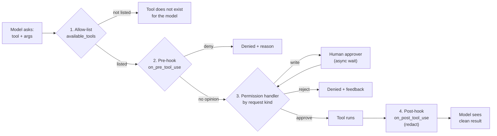

# Lesson 6: Permissions + tool hooks

Code: [`lessons/lesson_06_permissions_and_tool_hooks.py`](../../lessons/lesson_06_permissions_and_tool_hooks.py)
Run: `uv run python lessons/lesson_06_permissions_and_tool_hooks.py`

## 1. Story (simple)

1. **The model only asks.** It says "I want to run `bash`" or "I want to write `notes.md`". It cannot act alone.
2. **The harness decides.** Every tool call passes four gates, in order. Any gate can stop it.
3. **A human joins only when needed.** The permission handler can be `async`, so it can wait for a person.
4. **Results are cleaned before the model sees them.** A post-hook can hide card numbers or secrets.

Rule: **the model proposes, the harness disposes.** This is *tool* permission. *Business* approval (refund, re-capture) stays in the App.

## 2. The four gates



## 3. Which gate for which job

| Gate | Config | Sees | Best for |
|---|---|---|---|
| 1. Allow-list | `available_tools=[...]` | Tool names | Remove whole tools (no `web_fetch`) |
| 2. Pre-hook | `hooks={"on_pre_tool_use": fn}` | Tool name + args | Rules on targets (no `.env`), rewrite args |
| 3. Permission | `on_permission_request=fn` | Typed request (`shell`, `write`, `read`, `url`, `mcp`, `custom-tool`, ...) | Approve / reject / ask a human |
| 4. Post-hook | `hooks={"on_post_tool_use": fn}` | Tool result | Redact, trim, add context |

## 4. API map

| Goal | Code |
|---|---|
| Approve once | `PermissionDecisionApproveOnce()` |
| Reject with a reason | `PermissionDecisionReject(feedback="...")`: the model reads this text |
| Match request kind | `match request: case PermissionRequestShell(): ... request.full_command_text` |
| Write details | `PermissionRequestWrite` → `file_name`, `diff` |
| Pre-hook deny | `return {"permissionDecision": "deny", "permissionDecisionReason": "..."}` |
| Pre-hook no opinion | `return None` → go to gate 3 |
| Post-hook rewrite | `return {"modifiedResult": ...}` |

## 5. What we observed

Prompt: five steps. Read payment, read `app.env`, grep logs, `curl` a URL, write `notes.md`.

```text
pre-hook    pass view
permission  APPROVE read payment_1000.json
post-hook   REDACT card number in view result
pre-hook    DENY view: touches a .env secrets file        <- gate 2, gate 3 never asked
pre-hook    pass bash
permission  APPROVE shell `grep EXPIRED logs_1000.txt`    <- safe prefix
pre-hook    pass bash
permission  REJECT shell `curl -s https://example.com`    <- network
pre-hook    pass apply_patch
permission  APPROVE write notes.md (human)                <- async human approver

Summary: 1 allowed, 2 denied, 3 allowed, 4 denied, 5 allowed
notes.md written: True | secret leaked: False | full card in reply: False
```

Lessons learned while building it:

| Surprise | Fix |
|---|---|
| The model tried `bash cat app.env` after `view` was denied | The pre-hook checks `bash` commands too. Check **targets**, not tool names. |
| The pre-hook blocked `notes.md` because the notes *mentioned* `app.env` | Check the path or command only, not file content. |
| A vague reject message made the model skip later steps | Make `feedback` specific. The model obeys it. |
| The write tool name changes by model | GPT: `apply_patch`. Claude: `create` / `edit`. Allow-list both. |
| `PermissionHandler.approve_all` raised an error | Managed settings block it. Write your own handler. |

## 6. Map to the Order 1000 scenario

| Scenario need | Gate |
|---|---|
| Agent must never fetch random URLs | 1 (drop `web_fetch`) + 3 (reject network shell) |
| Never read secrets in the VM | 2 (pre-hook on targets) |
| Writing the investigation notes needs an OK | 3 (async approver; in production an App event plus a wait) |
| PCI data never reaches the model | 4 (redact card numbers) |
| "Issue a refund" | **Not here.** That is business approval in the App. |

## 7. Remember

- The order is: allow-list → pre-hook → permission → tool → post-hook.
- A pre-hook deny skips the permission handler.
- Feedback text steers the model. Write it like an instruction.
- Guard targets (paths, commands), not tool names. The model finds other tools.
- Every gate runs in **your** process. The model never sees your policy code.

## 8. Try it (one safe extension)

Change gate 3 to return `PermissionDecisionApproveForSession()` for the `grep` command. Add a step 6 that runs a second `grep`. You should see no second `APPROVE shell` line.
