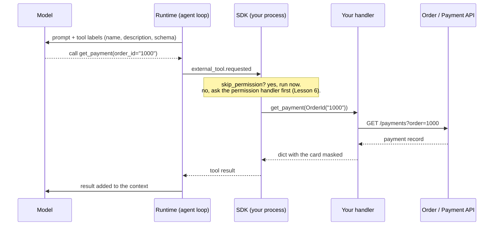

# Lesson 7: Custom tools

Code: [`lessons/lesson_07_custom_tools.py`](../../lessons/lesson_07_custom_tools.py)
Run: `uv run python lessons/lesson_07_custom_tools.py`

## 1. Story (simple)

1. **A tool is a function plus a label.** The label is a name, a description and a parameter schema.
2. **The model sees only the label.** It decides *when* to call the tool and *with what* arguments.
3. **Your code does the work.** The runtime asks the SDK. The SDK runs your Python handler in **your** process.
4. **The result goes back into the loop.** The model reads it and decides the next step.

Rule: **the model chooses, your handler executes.** Your API keys, identity and data rules stay in your code.

## 2. One tool call, end to end



## 3. Two kinds of tools

| Kind | Example | Setting | Why |
|---|---|---|---|
| Read-only | `get_order`, `get_payment`, `get_logs` | `skip_permission=True` | Cannot change anything, so no prompt is needed |
| Action | `propose_fix` | default (gated) + `is_terminal=True` | Changes state: approve first, then end the turn |

## 4. API map

| Goal | Code |
|---|---|
| Define a tool | `@define_tool(description="...")` on `def fn(params: MyModel)` |
| Parameter schema | Pydantic `BaseModel` with `Field(description=...)`. The model reads these descriptions. |
| Async handler | `async def fn(params) -> ...` (slow APIs, databases) |
| Return | `str`, `dict` (sent as JSON) or `ToolResult(text_result_for_llm=..., session_log=...)` |
| No permission prompt | `skip_permission=True` |
| End the turn after the call | `is_terminal=True` |
| Replace a built-in tool | `overrides_built_in_tool=True` |
| Register | `create_session(tools=[...])` |
| Only these tools | `available_tools=[t.name for t in tools]` |
| Gate a custom tool | Permission request kind `custom-tool` → `PermissionRequestCustomTool(tool_name, args)` |

Errors: if your handler raises, the SDK sends a failure result. The model sees it and can retry or explain.

## 5. What we observed

```text
call        get_order({'order_id': '1000'})      <- three reads, in parallel
call        get_payment({'order_id': '1000'})
call        get_logs({'order_id': '1000'})
result      success=True  x3
call        propose_fix({'order_id': '1000', 'action': 'Create a fresh inventory
            reservation, then capture the authorized payment PAY-501 against it.'})
permission  custom-tool propose_fix ...          <- gated: our handler approved it
result      success=True                         <- terminal: the turn ends here

ROOT CAUSE: Reservation RES-77 expired before payment capture, so the authorized
payment was rejected with RESERVATION_EXPIRED.
```

Notes:

- The model called the three read tools **in one step** (parallel tool calls). That is one loop iteration, not three.
- `is_terminal=True` skips the final model call. So the prompt asks for the `ROOT CAUSE` line **in the same reply** as the `propose_fix` call.
- With `available_tools` set to only our four tools, the context is small. There is no shell, file or web tool to misuse.

## 6. Map to the Order 1000 scenario

| Scenario step | Tool design |
|---|---|
| Fetch the order and payment | Read-only tools that call the App's APIs with the harness identity |
| Fetch the logs | Async tool; `ToolResult.session_log` keeps an audit line out of the model context |
| Hide PCI data | Mask in the handler (better than redacting later in a hook) |
| Propose a correction | Gated + terminal tool. In production it creates an approval request in the App. |
| Apply the correction | **Not a model tool.** The App runs it after a human approves. |

## 7. Remember

- The description and the field descriptions are the model's only manual. Write them carefully.
- Handlers run in your process. Secrets never go to the model.
- Read tools: `skip_permission=True`. Action tools: gated.
- Mask data at the source (the handler) when you can.
- `available_tools` also applies to custom tool names.

## 8. Try it (one safe extension)

Make `get_order` raise `ValueError` for any id other than `"1000"`. Then ask about order `2000`. Watch `success=False`, and see how the model explains the failure.
