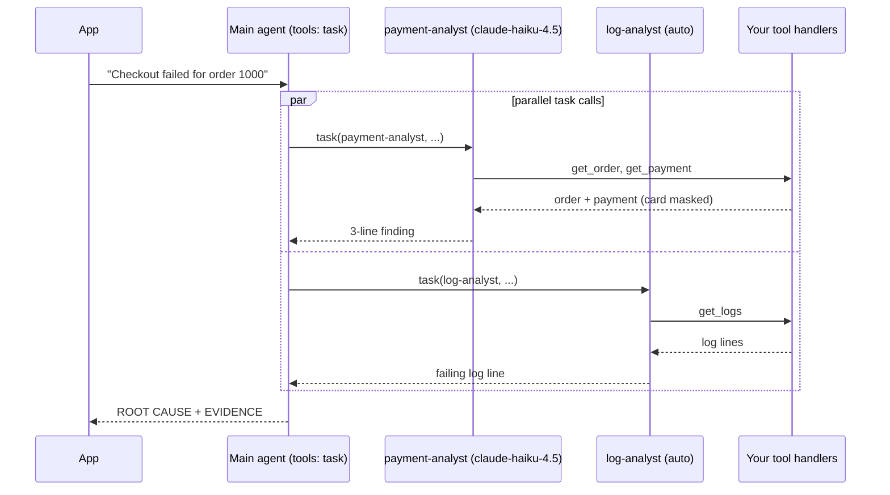

# Lesson 8: Custom agents

Code: [`lessons/lesson_08_custom_agents.py`](../../lessons/lesson_08_custom_agents.py)
Run: `uv run python lessons/lesson_08_custom_agents.py`

## 1. Story (simple)

1. **A custom agent is a specialist.** It has a name, a description, a prompt, its own tools and, optionally, its own model.
2. **The main agent is the coordinator.** It reads each description and delegates work with the built-in `task` tool.
3. **Each specialist works in its own context.** It sees only its own prompt and tools. The main context stays small.
4. **Same session, one event stream.** Specialist events arrive with `event.agent_id` set. The main agent combines the answers.

Rule: **description = when to call it. tools = what it may do. model = how much it costs.**

## 2. Delegation flow



## 3. Who can use which tool

| Agent | Tools | Model | Set by |
|---|---|---|---|
| Main | `task` only | `auto` | `available_tools` minus `default_agent.excluded_tools` |
| payment-analyst | `get_order`, `get_payment` | `claude-haiku-4.5` | `custom_agents[0].tools`, `.model` |
| log-analyst | `get_logs` | inherits `auto` | `custom_agents[1].tools` |

Two settings work together:

- `available_tools` = every tool that **exists** in the session. It must include `task`.
- `default_agent={"excluded_tools": [...]}` = hide tools from the **main** agent only. It is forced to delegate.

## 4. API map

| Goal | Code |
|---|---|
| Define agents | `create_session(custom_agents=[{name, display_name, description, prompt, tools, model}])` |
| Other agent fields | `infer` (default `True`: the main agent may pick it), `skills`, `mcp_servers`, `reasoning_effort` |
| Start in one agent | `create_session(agent="log-analyst")` or `session.rpc.agent.select(...)` later |
| Restrict the main agent | `default_agent={"excluded_tools": [...]}` |
| Track sub-agents | `subagent.started` (`agent_name`, `model`, `tool_call_id`), `subagent.completed` (`duration`, `model`), `subagent.failed` (`error`) |
| Who emitted an event | `event.agent_id` (`None` = main agent) |

## 5. What we observed

```text
[main] call task(...)                                 <- two delegations in one step
[main] call task(...)
[main] -> start payment-analyst (model=claude-haiku-4.5)
[main] -> start log-analyst (model=gpt-6-luna)
[log-analyst]     call get_logs({'order_id': '1000'})
[payment-analyst] call get_order({'order_id': '1000'})
[payment-analyst] call get_payment({'order_id': '1000'})
[main] <- done  log-analyst model=gpt-6-luna 4.4s
[main] <- done  payment-analyst model=claude-haiku-4.5 4.6s

ROOT CAUSE: The inventory reservation expired before payment capture, causing
capture to be rejected and checkout to fail.
EVIDENCE:
- Logs show reservation RES-77 expired at 10:02:01; capture PAY-501 was rejected
  with RESERVATION_EXPIRED at 10:02:05.
- Payment PAY-501 was authorized for $84.20, but order 1000 ended in PAYMENT_FAILED.
```

Gotchas found while building it:

| Surprise | Fix |
|---|---|
| `subagent.completed` arrived **twice** for each agent | De-duplicate by `tool_call_id` |
| Sub-agent tool events carry a UUID, not a name | Map `event.agent_id` from `subagent.started` to `agent_name` |
| Each agent followed its own `model` | Haiku for payment; the main agent's `auto` for logs |

## 6. Map to the Order 1000 scenario

| Scenario need | Agent design |
|---|---|
| Separate payment and log analysis | Two specialists, each with a narrow tool list |
| Cheap work on narrow jobs | `model="claude-haiku-4.5"` on the specialist |
| Main context stays clean | Specialists read raw data; only short findings come back |
| Least privilege | The main agent has no business tools at all |
| Audit "who did what" | `subagent.*` events + `event.agent_id` → the App's case timeline |

## 7. Remember

- The description is the routing rule. Make it specific.
- Specialist tools must also be in `available_tools`, and `task` must be there too.
- Use `default_agent.excluded_tools` to force delegation.
- Sub-agents run in their own context but in the **same** session and VM. Permissions and hooks (Lesson 6) still apply.
- Parallel delegation = faster, but you pay for more model calls.

## 8. Try it (one safe extension)

Add a third agent, `fix-planner`, with only `propose_fix` from Lesson 7. Add `propose_fix` to `available_tools` and `excluded_tools`. Ask the main agent to send the combined finding to `fix-planner`.

## Later: background features

> Not run yet. Deferred until SDK GA ([list](../sdk-concepts.md#5-deferred-until-sdk-ga)). Verified to exist in SDK 1.0.16.

| Feature | Try it |
|---|---|
| Message provenance | `from copilot import AgentMessageSource`, then `await session.send("Looks good.", source=AgentMessageSource("reviewer"))`. Other values: `source="user"`, `source="system"`. Use it so an agent's "approve" can never be mistaken for a human approval. |
