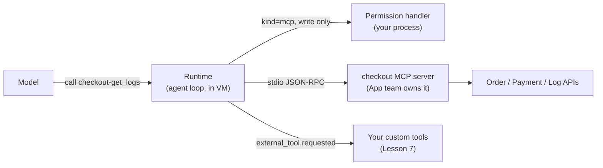

# Lesson 9: MCP servers

Code: [`lessons/lesson_09_mcp_servers.py`](../../lessons/lesson_09_mcp_servers.py) and the server [`lessons/checkout_mcp_server.py`](../../lessons/checkout_mcp_server.py)
Run: `uv run python lessons/lesson_09_mcp_servers.py`

## 1. Story (simple)

1. **MCP is a standard plug for tools.** A team writes its tools once, as an MCP server.
2. **Any agent can use the plug.** That includes the Copilot SDK, Copilot CLI, VS Code and Foundry agents.
3. **The session only names the server.** It says how to start it (`stdio`) or where it lives (`http`). The runtime connects and lists the tools.
4. **Calls skip your Python code.** They go runtime → MCP server. Your permission handler still sees write calls.

Rule: **custom tool (Lesson 7) = code inside your harness. MCP tool = code owned by another team, behind a standard plug.**

## 2. Where MCP sits



## 3. Custom tool or MCP tool?

| Question | Custom tool (Lesson 7) | MCP tool (Lesson 9) |
|---|---|---|
| Who owns the code? | The harness team | The API team |
| Where does it run? | In your SDK process | In the MCP server process (local or remote) |
| Reuse in other agents | No | Yes (CLI, VS Code, Foundry, ...) |
| Name the model sees | `get_logs` | `checkout-get_logs` (`<server>-<tool>`) |
| Permission kind | `custom-tool` (or skipped) | `mcp` (`server_name`, `tool_name`, `read_only`, `args`) |

## 4. API map

| Goal | Code |
|---|---|
| Local server | `mcp_servers={"checkout": {"type": "stdio", "command": ..., "args": [...], "tools": ["*"]}}` |
| Remote server | `{"type": "http", "url": "https://...", "headers": {...}, "tools": ["*"]}` |
| Choose tools | `"tools": ["*"]` all, `[]` none, or a list of names |
| Hide other servers' tools | `available_tools=["checkout-get_order", ...]` |
| Gate writes | `case PermissionRequestMcp(): request.server_name, request.tool_name, request.args` |
| Watch connection | `session.mcp_server_status_changed` (`server_name`, `status`), `session.mcp_servers_loaded` |
| Build the server (Python, mcp 2.x) | `from mcp.server.mcpserver import MCPServer`; `@server.tool(annotations=ToolAnnotations(readOnlyHint=True))` |

## 5. What we observed

```text
mcp         checkout -> pending
mcp         checkout -> connected
mcp         loaded 8 servers; checkout=connected       <- 7 more come from ~/.copilot config
call        checkout-get_order({'order_id': '1000'})    <- read-only: no permission prompt
call        checkout-get_payment({'order_id': '1000'})
call        checkout-get_logs({'order_id': '1000'})
call        checkout-add_case_note({... 'note': 'Root cause: ... RES-77 expired ...'})
permission  ASK     mcp write checkout/checkout-add_case_note
human       approve checkout-add_case_note? -> yes (simulated)

ROOT CAUSE: Reservation RES-77 expired before capture, causing payment PAY-501 to be rejected.
```

Findings:

| Surprise | Meaning |
|---|---|
| Read-only tools never reached the permission handler | `readOnlyHint=True` is trusted by the runtime. Only mark tools that truly cannot change anything. |
| Write tool → `kind=mcp` request | Same human gate as Lesson 6, with no extra code in the server |
| 8 servers loaded, not 1 | The user's global MCP config also loads. Use `available_tools` to keep the context clean. |
| `mcp` 2.x renamed `FastMCP` | Use `MCPServer` from `mcp.server.mcpserver` |

## 6. Map to the Order 1000 scenario

| Scenario need | MCP design |
|---|---|
| App team owns the checkout APIs | They ship a `checkout` MCP server (HTTP in production) |
| Harness in the Foundry VM | `mcp_servers={"checkout": {"type": "http", "url": ..., "headers": {"Authorization": ...}}}` |
| Reads are safe | `readOnlyHint=True` on `get_*` tools |
| Case notes are writes | No hint → `kind=mcp` permission → human or policy |
| Same tools in VS Code for engineers | Point VS Code at the same MCP server |

## 7. Remember

- MCP = tools behind a standard plug. Write once, use from many agents.
- Tool names get a prefix: `<server>-<tool>`.
- `readOnlyHint` controls auto-approval. Treat it as a security setting.
- Global MCP servers also load. Filter with `available_tools`.
- Mask sensitive data in the server, at the source (as in `get_payment`).

## 8. Try it (one safe extension)

Run the server over HTTP: `server.run("streamable-http")`. Then change the config to `{"type": "http", "url": "http://127.0.0.1:8000/mcp", "tools": ["*"]}`. The agent run should look the same.

## Later: background features

> Not run yet. Deferred until SDK GA ([list](../sdk-concepts.md#5-deferred-until-sdk-ga)). Verified to exist in SDK 1.0.16.

| Feature | Try it |
|---|---|
| Installation confirmation (experimental) | `CopilotClient(installation_confirmation_handler=handler)`. The runtime asks the handler before an MCP server or skill is **installed**; return an explicit confirm, decline or cancel. A human review gate for new integrations. |
