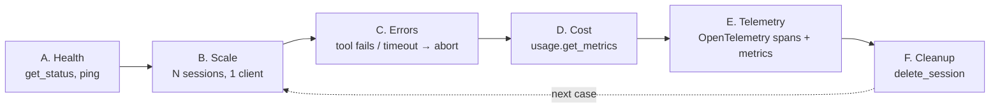

# Lesson 10: Observability + scaling (operations)

Code: [`lessons/lesson_10_observability_and_scaling.py`](../../lessons/lesson_10_observability_and_scaling.py)
Run: `uv run python lessons/lesson_10_observability_and_scaling.py`

## 1. Story (simple)

1. **Check health first.** Ask the runtime its version and ping it before you accept work.
2. **One client serves many sessions.** One runtime process can run many investigations in parallel.
3. **Expect failures.** Tools break and turns run long. The harness must recover and keep the session usable.
4. **Measure everything.** Count tokens and cost per session. Export traces to your monitoring.
5. **Clean up.** Sessions stay on disk until you delete them.

Rule: **healthy → parallel → resilient → measured → clean.**

## 2. Operations loop



## 3. Failure playbook

| Failure | What the SDK does | What you do |
|---|---|---|
| Tool handler raises | Sends a failed tool result (`success=False`) | Nothing. The model explains or retries. Log it. |
| Turn too slow | `send_and_wait(timeout=)` raises `TimeoutError` | `session.abort()`, wait for `session.idle`, continue |
| Model or provider error | `session.error` event; `send_and_wait` raises | Retry, or switch the model (`set_model`) |
| Runtime died | Calls fail | New client + `resume_session` (Lesson 2) |

Important: a **timeout stops the waiting, not the work.** Only `abort()` stops the turn.

## 4. API map

| Goal | Code |
|---|---|
| Health | `await client.get_status()` → `version`, `protocol_version`; `await client.ping("x")` |
| Parallel sessions | `asyncio.gather(*(run_case(client, q) for q in cases))` |
| Stop a turn | `await session.abort()`: the session stays valid |
| Cost per session | `await session.rpc.usage.get_metrics()` → `model_metrics[m].usage.input_tokens`, `output_tokens`, `requests.cost`, `total_nano_aiu` |
| Telemetry | `CopilotClient(telemetry={"exporter_type": "otlp-http", "otlp_endpoint": ...})` or `{"exporter_type": "file", "file_path": ...}` |
| Content in traces | `telemetry={"capture_content": True}`: off by default (PII) |
| Idle cleanup | `CopilotClient(session_idle_timeout_seconds=...)` |
| Delete | `await client.list_sessions()`, `await client.delete_session(id)` |
| Spend cap (experimental) | `create_session(session_limits={"max_ai_credits": ...})` |

## 5. What we observed

```text
A. runtime 1.0.90 protocol 3; ping -> pong: health

B. 3 sessions in parallel, one client
   [aa725dc1] 5.1s tokens=6632 `10:02:05 payment-api capture PAY-501 rejected: RESERVATION_EXPIRED`
   [d3372323] 5.1s tokens=6595 Order 1000 is PAYMENT_FAILED; total is $84.20 USD.
   [24c0c6c6] 5.5s tokens=6751 Payment PAY-501 was authorized ... capture was rejected ...
   wall clock 5.5s vs 15.6s if run one by one

C1. tool-done success=False error=Tool execution failed
    reply: I couldn't retrieve the refund policy for order 1000 because the lookup failed.

C2. send_and_wait timed out after 3s -> session.abort()
    aborted turn reached session.idle
    same session after abort: still alive

F. deleted 5 sessions; listed 157 -> 152

E. 586 records; gen_ai spans: chat=10, invoke_agent=6, execute_tool=5
   metrics: gen_ai.client.inference.usage.input_tokens / output_tokens / reasoning.output_tokens,
            gen_ai.client.operation.duration, gen_ai.invoke_agent.tool_calls, ...
```

Notes:

- The lean sessions (only three tools) used about 6.6k tokens each. A default session uses about 33k (Lesson 4).
- The tool error text that reaches the model is generic ("Tool execution failed"). The real exception stays in your process, so log it there.
- After `abort()`, **wait for `session.idle`** before the next send. Without this wait, the next `send_and_wait` returned `None`.
- The SDK logs `CopilotSession.send_and_wait failed` on a timeout. This is expected.
- Spans follow the OpenTelemetry **GenAI semantic conventions** (`gen_ai.*`). Azure Monitor / App Insights can ingest them directly over OTLP.

## 6. Map to the Order 1000 scenario (Foundry Hosted Agent)

| Production need | Lesson 10 tool |
|---|---|
| Readiness probe for the VM | `get_status` + `ping` |
| Many cases at once | One client per VM, many sessions (or one VM per session in Foundry) |
| Slow log search | Timeout → `abort()` → tell the user, keep the case open |
| Cost per case in the App | `usage.get_metrics()` → write it to the case record |
| Dashboards and alerts | `telemetry` → OTLP → Application Insights |
| Disk on `$HOME` | `delete_session` when the case closes, or `session_idle_timeout_seconds` |

## 7. Remember

- A timeout stops the waiting. `abort()` stops the work.
- Tool exceptions do not crash the turn. The model sees a failure.
- Read cost from `usage.get_metrics()`, per session.
- Telemetry is a **client** setting and uses OpenTelemetry GenAI names.
- Sessions live on disk until deleted.

## 8. Try it (one safe extension)

Change B to 6 questions. Watch the wall clock: does it stay close to the slowest single session? Then add `session_limits={"max_ai_credits": 0.01}` to one session and see what event or error you get.
