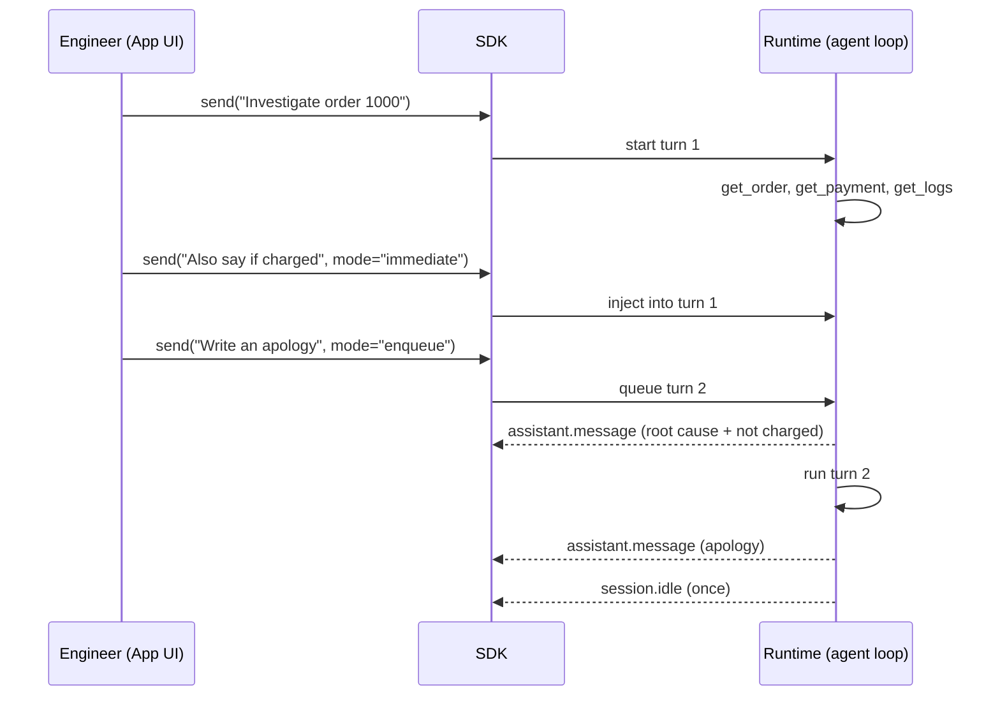

# Lesson 11: Steering and queueing

Code: [`lessons/lesson_11_steering_and_queueing.py`](../../lessons/lesson_11_steering_and_queueing.py)
Run: `uv run python lessons/lesson_11_steering_and_queueing.py`

## 1. Story (simple)

1. **The agent is working.** It is calling tools for Order 1000.
2. **The engineer remembers a detail.** "Also say if the customer was charged." This must change the **current** answer, so the engineer **steers**.
3. **The engineer adds a next task.** "Then write an apology." This must wait for the current answer, so the engineer **queues** it.
4. **One idle at the end.** The session goes idle only after the steered turn and the queued turn are both done.

Rule: **steer changes now; queue adds next.**

## 2. Timeline



## 3. Steer vs queue

| Mode | When it runs | Use for |
|---|---|---|
| `mode="immediate"` (steer) | Injected into the **current** turn | Add a requirement to the answer being built |
| `mode="enqueue"` (queue) | A new turn **after** the current one | A follow-up task |
| default `send` while idle | Starts a turn now | A normal prompt |

## 4. API map

| Goal | Code |
|---|---|
| Start a turn without waiting | `await session.send(prompt)` |
| Steer | `await session.send(text, mode="immediate")` |
| Queue | `await session.send(text, mode="enqueue")` |
| Know when all work is done | Subscribe with `session.on(...)`, wait for `SessionIdleData` |

## 5. What we observed

```text
call        get_order
call        get_payment
call        get_logs
message     Checkout failed because reservation RES-77 expired before payment capture, so capture was
            rejected. The customer was not charged; payment was authorized, but not captured.   <- steer, same turn
message     We're sorry, but your checkout couldn't be completed because the item reservation
            expired; you were not charged.                                                      <- queued turn
idle                                                                                           <- once
```

Gotchas:

- `session.idle` fires **once**, after the steer and the queue are done. Do not wait for one idle per message.
- A steering message cannot carry its own `response_schema`.
- Use `send` (not `send_and_wait`) for the first prompt; otherwise you cannot steer while it runs.

## 6. Map to the Order 1000 scenario (Foundry Hosted Agent)

| Need | Lesson 11 tool |
|---|---|
| Engineer adds a detail while the agent works | steer (`immediate`) |
| Follow-up task after the investigation | queue (`enqueue`) |
| UI shows "done" only when everything finished | wait for the single `session.idle` |

## 7. Remember

- Steer changes the current turn. Queue adds the next turn.
- One idle for the whole batch.
- The App decides which mode a UI action maps to.

## 8. Try it (one safe extension)

Send the steer message **after** the first `assistant.message` arrives. Does it still change turn 1, or does it start a new turn?
