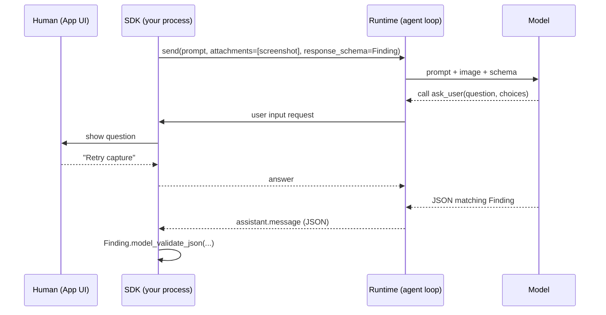

# Lesson 12: User input and structured output

Code: [`lessons/lesson_12_user_input_and_structured_output.py`](../../lessons/lesson_12_user_input_and_structured_output.py)
Run: `uv run python lessons/lesson_12_user_input_and_structured_output.py` (Part B needs the dev dependency `pillow`: `uv sync`)

## 1. Story (simple)

1. **The agent asks.** It stops mid-turn and asks the human a question. The App shows it and returns the answer.
2. **The customer sends a picture.** A screenshot goes in as an attachment. The model reads it.
3. **The App needs data, not prose.** The final answer comes back as JSON that matches a schema.

Rule: **ask → see → structure.**

## 2. Data in, data out



## 3. Three channels

| Channel | Direction | SDK piece |
|---|---|---|
| `ask_user` | Agent → human → agent, mid-turn | `on_user_input_request` handler |
| Image input | Human → agent | `attachments=[{"type": "blob", ...}]` |
| Structured output | Agent → App | `response_schema=PydanticModel` |

## 4. API map

| Goal | Code |
|---|---|
| Agent asks the human | `create_session(on_user_input_request=handler)` and `"ask_user"` in `available_tools` |
| Handler input / output | `request["question"]`, `request["choices"]`, `request["allowFreeform"]` → `{"answer": str, "wasFreeform": bool}` |
| Image | `attachments=[{"type": "blob", "data": b64, "mimeType": "image/png", "displayName": "x.png"}]` |
| File on disk | `attachments=[{"type": "file", "path": "/abs/path"}]` |
| Structured output | `send_and_wait(prompt, response_schema=Model)` → `Model.model_validate_json(reply.data.content)` |

## 5. What we observed

```text
A. agent asks  Order 1000 is marked PAYMENT_FAILED: payment PAY-501 remains authorized, but capture was
               rejected after reservation RES-77 expired. Which action should I plan for?
   choices     ['Retry capture', 'Refund customer']
   human says  Retry capture
   final       Root cause: ...reservation expired before payment PAY-501 could be captured...
               Plan: Verify stock, create a fresh reservation, then retry capture for $84.20.

B. final       Order ID: 1000; screenshot error: RESERVATION_EXPIRED (ref PAY-501).
               Confirmed in the logs: reservation RES-77 expired, then capture PAY-501 was rejected.

C. validated   Finding confidence=0.99
   {"order_id": "1000",
    "root_cause": "The inventory reservation expired before payment capture, so the capture was rejected...",
    "evidence": ["10:00:01 ... RES-77 (120-second TTL)", "10:00:04 ... authorized 84.20 USD",
                 "10:02:01 RES-77 expired; 10:02:05 capture rejected ... PAYMENT_FAILED"],
    "proposed_fix": "Capture before the reservation expires, or renew/recreate it before capture ...",
    "confidence": 0.99}
```

Gotchas:

- `ask_user` is a built-in tool. If you set `available_tools`, add `"ask_user"`, otherwise the agent cannot ask.
- Strict schemas (OpenAI models) need `additionalProperties: false`. In Pydantic: `model_config = ConfigDict(extra="forbid")`. Without it we got HTTP 400.
- Validate the JSON in the App. The schema guides the model; it is not a guarantee.

## 6. Map to the Order 1000 scenario (Foundry Hosted Agent)

| Need | Lesson 12 tool |
|---|---|
| Support engineer approves retry vs refund | `ask_user` → App UI → answer |
| Customer screenshot | blob attachment |
| Store the finding in the case system | `response_schema=Finding` |

## 7. Remember

- The agent can ask. The App decides who answers.
- Images are attachments, not tools.
- Validate structured output in the App. Never trust the shape blindly.

## 8. Try it (one safe extension)

Change the simulated human in Part A to a freeform answer ("Wait for the customer"). Check that `wasFreeform` is `True` and see how the plan changes.

## Later: background features

> Not run yet. Revisit before the capstone ([list](../sdk-concepts.md#5-revisit-before-the-capstone)). Verified to exist in SDK 1.0.16.

| Feature | Try it |
|---|---|
| Typed output in one call | `finding = await session.send_and_wait_typed(prompt, Finding)` returns a validated `Finding`, replacing `response_schema=` + `model_validate_json`. |
| Form-based `ask_user` | `create_session(ask_user_variant="elicitation", on_elicitation_request=handler)`. The handler returns `{"action": "accept" \| "decline" \| "cancel", "content": {...}}`, a structured form instead of a free-text answer. |
