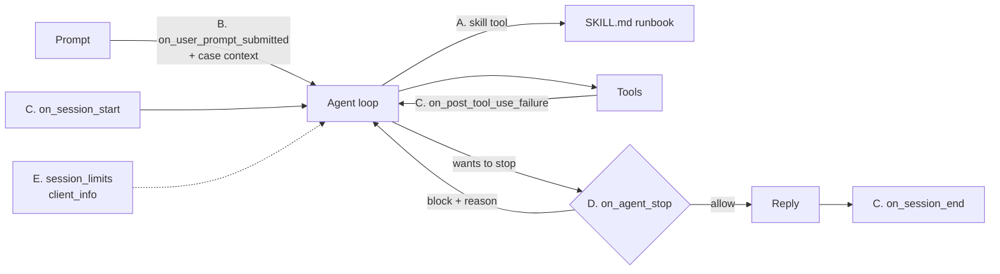

# Lesson 13: Skills + lifecycle hooks

Code: [`lessons/lesson_13_skills_and_lifecycle_hooks.py`](../../lessons/lesson_13_skills_and_lifecycle_hooks.py) · Skill: [`lessons/skills/checkout-runbook/SKILL.md`](../../lessons/skills/checkout-runbook/SKILL.md)
Run: `uv run python lessons/lesson_13_skills_and_lifecycle_hooks.py`

## 1. Story (simple)

1. **Skills = runbooks.** A `SKILL.md` file holds team know-how. The agent loads it only when the task matches.
2. **Hooks = the App's hands in the loop.** The App adds context to prompts, records the timeline, and can refuse to let the agent stop.
3. **Limits = a budget.** Each case gets a maximum AI credit spend.
4. **Client info = a name tag.** The runtime knows which App is calling.

Rule: **change behavior with files and hooks, not with a new model.**

## 2. Where each extension acts in one turn



## 3. All hooks (Lessons 6 + 13)

| Hook | When | Can return | Lesson |
|---|---|---|---|
| `on_pre_tool_use` | Before a tool runs | allow / deny / modified args | 6 |
| `on_pre_mcp_tool_call` | Before an MCP tool runs | same, for MCP | 6, 9 |
| `on_post_tool_use` | After a tool succeeds | modified result, extra context | 6 |
| `on_post_tool_use_failure` | After a tool fails | (observe) | 13 C |
| `on_user_prompt_submitted` | User prompt arrives | `modifiedPrompt`, `additionalContext` | 13 B |
| `on_user_prompt_transformed` | After the runtime expands the prompt | `modifiedTransformedPrompt` | doc only |
| `on_session_start` | Session opens (`source`: new / resume) | `additionalContext`, `modifiedConfig` | 13 C |
| `on_session_end` | Session closes (`reason`) | `sessionSummary`, `cleanupActions` | 13 C |
| `on_error_occurred` | Runtime / model error | `errorHandling`, `retryCount`, `userNotification` | 13 C |
| `on_agent_stop` | Agent wants to finish | `{"decision": "block", "reason": ...}` | 13 D |

## 4. API map

| Goal | Code |
|---|---|
| Load skills | `create_session(skill_directories=["lessons/skills"])` + `"skill"` in `available_tools` |
| Skill file | `<dir>/<name>/SKILL.md` with frontmatter `name`, `description` |
| Turn skills off | `disabled_skills=["name"]` or `enable_skills=False` |
| Skill for a sub-agent | `custom_agents=[{..., "skills": ["checkout-runbook"]}]` (preloaded) |
| See skill use | `SkillInvokedData` event (`name`, `path`) |
| Hooks | `create_session(hooks={"on_agent_stop": fn, ...})`; `fn(hook_input, invocation)` can be async |
| Spend cap (experimental) | `create_session(session_limits={"max_ai_credits": 30.0})`; minimum is **30** |
| App identity | `CopilotClient(client_info={"application_name": ..., "application_version": ...})` |

## 5. What we observed

```text
A. skill       checkout-runbook (lessons/skills/checkout-runbook/SKILL.md)
   RUNBOOK: checkout-runbook v3
   CLASS: RESERVATION_EXPIRED
   FIRST FAILURE: 10:02:01 inventory     reservation RES-77 EXPIRED
   ROOT CAUSE: Reservation RES-77 expired before payment capture, so capture was rejected ...

B. hook        user_prompt_submitted: 'Which case, tenant and tier am I working on? One line.'
   final       CASE-77, contoso, GOLD.

C. timeline    start  source=new
   timeline    tool-failed get_refund_policy: Tool execution failed
   timeline    tool-failed get_refund_policy: Tool execution failed     <- model retried once
   timeline    end    reason=complete

D. call        get_order
   hook        agent_stop #1: block, ask for ROOT CAUSE line
   call        get_logs                                                 <- agent kept working
   final       ROOT CAUSE: "10:02:05 payment-api  capture PAY-501 rejected: RESERVATION_EXPIRED"

E. limit       max_ai_credits=100.0, used nano_aiu=42751800 (about 0.04 credits)
   events      no limit events (well under the cap)
```

Gotchas:

- The prompt said only "Investigate". The skill's `description` was enough for the agent to pick it, and the reply used the skill's exact format.
- A failed **tool** fires `on_post_tool_use_failure`, not `on_error_occurred`. `on_error_occurred` is for runtime or model errors.
- `on_agent_stop` can loop forever. Stop blocking when `stopHookActive` is true, or after N blocks.
- `session_limits` below 30 AI credits fails at `create_session`: "Minimum session limit is 30 AI credits".
- `session.set_tools` (change tools mid-session) is in the docs on `main` but not in Python SDK 1.0.16.

## 6. Map to the Order 1000 scenario (Foundry Hosted Agent)

| Need | Lesson 13 tool |
|---|---|
| Team runbook versioned in git | Skill folder, shipped in the agent image |
| Case id and tenant on every prompt | `on_user_prompt_submitted` → `additionalContext` |
| Case audit timeline in the App | lifecycle + failure hooks |
| "Never close without a root cause" | `on_agent_stop` quality gate |
| Budget per case | `session_limits` |
| Know which App spends what | `client_info` |

## 7. Remember

- Skills hold know-how. Tools do actions. Hooks hold App policy.
- The skill `description` decides when the skill is used. Write it well.
- Hooks run in **your** process, with the App's data.
- Every blocking hook needs an exit condition.

## 8. Try it (one safe extension)

Add `disabled_skills=["checkout-runbook"]` to Part A and compare the reply format. Then add a `custom_agents` specialist with `"skills": ["checkout-runbook"]` and see the skill preloaded with no `skill` call.

## Later: background features

> Not run yet. Deferred until SDK GA ([list](../sdk-concepts.md#5-deferred-until-sdk-ga)).

| Feature | Try it |
|---|---|
| Installation confirmation (experimental) | `CopilotClient(installation_confirmation_handler=...)` also gates **skill** installs. See [Lesson 9](lesson-09-mcp-servers.md#later-background-features). |
