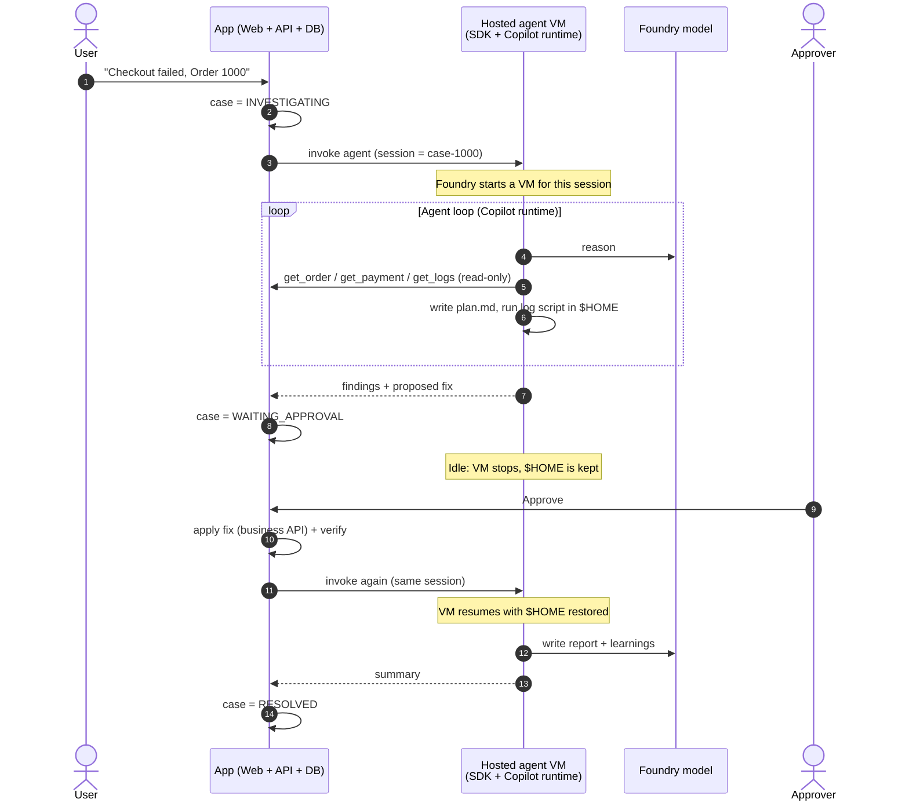
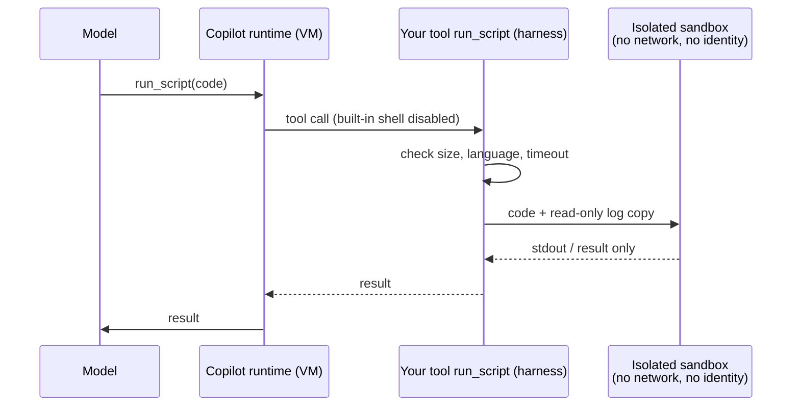

# Scenario: Order 1000 on Foundry Hosted Agents

Interactive version: open [explainer-checkout-flow.html](explainer-checkout-flow.html) in a browser.

## Three layers

| Layer | What | Job |
|---|---|---|
| **App** | Web app + API + DB | Owns the case, approval, and fix |
| **Agent harness** | Your agent code + Copilot SDK + Copilot runtime | *How* the agent works: loop, tools, plan.md, context |
| **Runtime infra** | Foundry Hosted Agent (one VM sandbox per session) | *Where* it runs: identity, isolation, files kept across idle |

Model inference: Foundry model, called by the Copilot runtime (BYOK, agent identity).

## Flow

## Remember

- The agent **investigates**. The app **approves and fixes**.
- The SDK and runtime run **inside** the VM. They are the harness, not the infra.
- The VM keeps files (`$HOME`) across idle. Keep the Copilot session data there so `resume_session` works.
- Business truth (case, approval, fix) lives in the app DB, never in the VM.
- Two kinds of approval:
  - **Tool permission** ("may the agent run this script?"): decided in the **harness** by your `on_permission_request` handler / pre-tool hook.
  - **Business approval** ("may we refund?"): decided by a **human in the app**.
- Only the harness runs in the VM. The app and the model run outside it.

Sources: [Foundry hosted agents](https://learn.microsoft.com/azure/foundry/agents/concepts/hosted-agents) ·
[Copilot SDK checkout example](https://github.com/ppenumatsa1/model-to-harness/tree/main/harness/checkout-recovery/copilot-sdk)

## Untrusted script: run it somewhere else

The harness VM has an identity that can call your APIs. Do not run model-written code next to it.

1. Turn off the built-in shell (`available_tools` / `excluded_tools`).
2. Give the agent one custom tool: `run_script(code)`.
3. The tool sends the code to a **separate** sandbox, such as Azure Container Apps dynamic sessions or the Foundry code interpreter tool.
4. The sandbox gets only a copy of the data. It has no credentials and no network access, and it has a time limit.
5. Only the output comes back.

Rule: **the harness holds the identity; the sandbox holds the untrusted code. Never both.**
