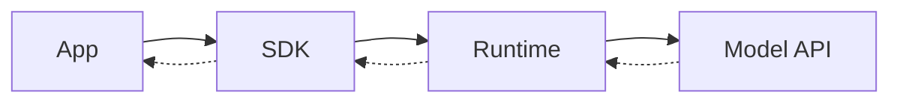
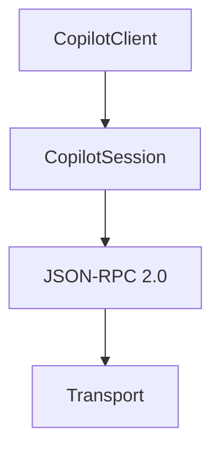
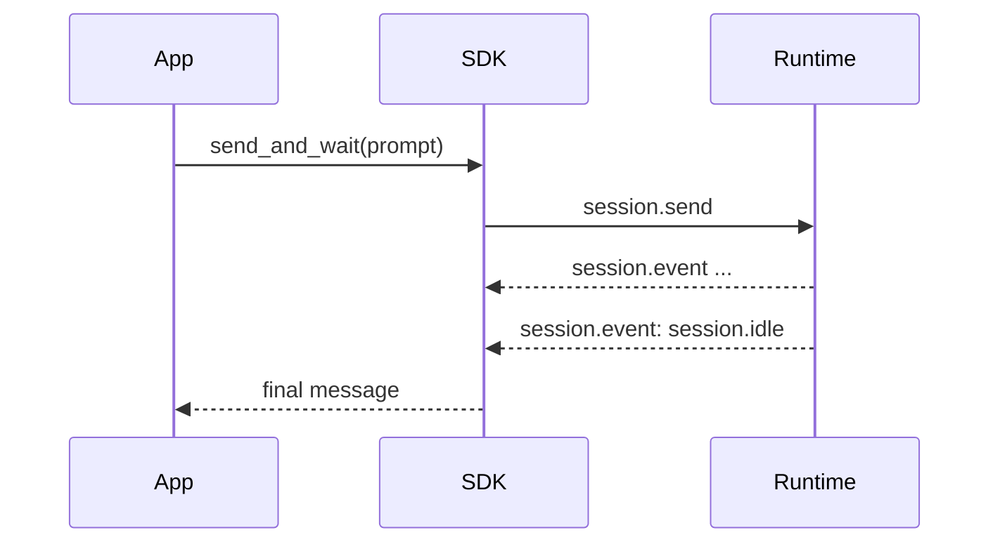
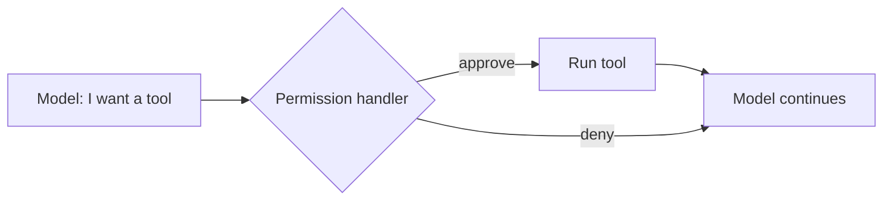
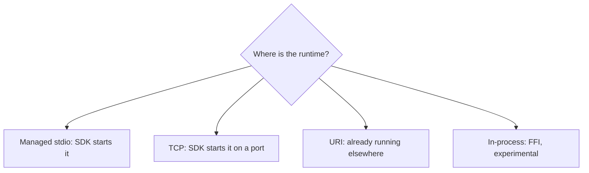
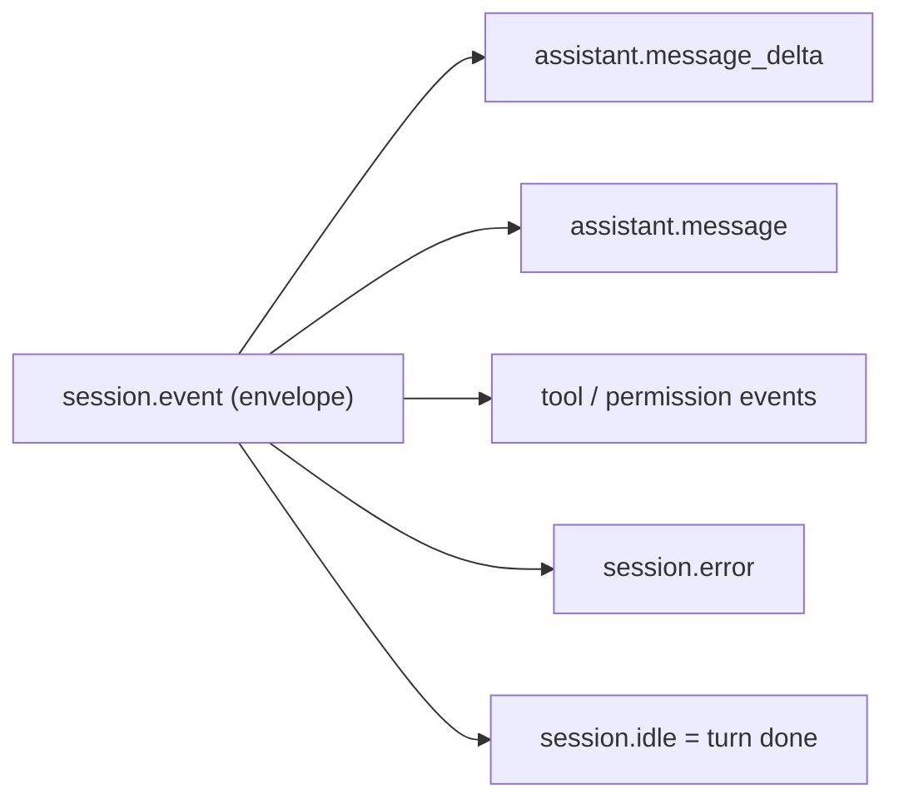

# Architecture Quiz

Six levels. Each level adds one layer. Try to answer before you open the answer.

Study first: [sdk-architecture.md](sdk-architecture.md).

---

## Level 1: The four boxes

**Q1.1** Name the four boxes in order, from your code to the model.

Answer

App → SDK → Runtime → Model API.

**Q1.2** Which box runs the agent loop?

Answer

The runtime. The SDK only connects to it and carries messages.

**Q1.3** Is the SDK an LLM wrapper? Why or why not?

Answer

No. The SDK controls an agent runtime. The runtime plans, calls tools, and talks to the model. Your app never calls the model directly.

---

## Level 2: Inside the SDK

**Q2.1** What is the job of `CopilotClient`? What is the job of `CopilotSession`?

Answer

- Client: connects to the runtime and manages its lifecycle. Creates and resumes sessions.
- Session: one live agent workspace. It holds context, model, tools, the permission handler, and event listeners.

**Q2.2** Can one client have many sessions?

Answer

Yes. One client, many sessions. Each user or task should get its own session.

**Q2.3** What format do the SDK and the runtime use to talk? What carries it by default?

Answer

JSON-RPC 2.0. By default it goes over stdio to a CLI process that the SDK starts.

---

## Level 3: Request and response

**Q3.1** Name the one runtime-to-SDK message type that carries all events.

Answer

`session.event`. Text, tool activity, errors, and idle all arrive this way.

**Q3.2** Which event tells you the turn has finished?

Answer

`session.idle`.

**Q3.3** What is the difference between `send()` and `send_and_wait()`?

Answer

- `send()` sends the prompt and returns at once. You watch events to see progress and the end.
- `send_and_wait()` sends, then waits for `session.idle`. It returns the last assistant message. It can return `None` if no message came.

**Q3.4** You want text to appear word by word. What do you need?

Answer

Set `streaming=True` on the session. Then handle `assistant.message_delta` events.

---

## Level 4: Tools and permissions

**Q4.1** Who decides if a tool may run: the model, the runtime, or your app?

Answer

Your app, through the permission handler. The model only asks.

**Q4.2** A built-in tool (such as reading a file) and your custom Python tool. Where does each one run?

Answer

- Built-in tool: inside the runtime process.
- Custom tool: in your Python process. The runtime sends `external_tool.requested`. The SDK calls your handler. The SDK sends the result back with `session.tools.handlePendingToolCall`.

**Q4.3** After a tool runs, does the turn end?

Answer

Not always. The result goes back to the model. The model can answer, ask for another tool, or finish. The turn ends at `session.idle`.

**Q4.4** What happens if you give no permission handler?

Answer

Permission requests come as events and stay pending. Your app must resolve them some other way. For safe code, always give a handler.

---

## Level 5: Deployment shapes

**Q5.1** Which shape does `CopilotClient()` use with no options?

Answer

Managed stdio. The SDK downloads a pinned runtime, starts it, and stops it.

**Q5.2** You run a web backend with many servers. Which shape fits best?

Answer

URI: connect to a runtime server that runs on its own. Use `RuntimeConnection.for_uri(...)`.

**Q5.3** What changes with BYOK? What stays the same?

Answer

- Changes: the runtime calls your own model provider with your key, not the GitHub Copilot API.
- Same: the app, SDK, sessions, events, tools, and permissions.

---

## Level 6: Put it all together

**Q6.1** Trace this request from start to end. Name each component and message.

> A user types "What files are in this folder?" in your web app. The agent must use a file-list tool.

Answer

1. Web app checks the user and picks that user's session.
2. App calls `session.send(...)`.
3. SDK sends `session.send` (JSON-RPC 2.0) over the transport.
4. Runtime adds the prompt to the session context and calls the model API.
5. Model asks for a file-list tool.
6. Runtime sends `session.event` with `permission.requested`.
7. SDK calls your permission handler. Your app approves.
8. SDK sends the decision back with `session.permissions.handlePendingPermissionRequest`.
9. Runtime runs the tool and gives the result to the model.
10. Model writes the answer. Runtime sends `assistant.message`, then `session.idle`.
11. SDK routes the events. App shows the answer.

**Q6.2** Two users share one client. What must you keep separate? Whose job is it?

Answer

- Keep separate: sessions, context, credentials, working folders, tools, and data.
- Your app's job. The SDK gives you isolated sessions. Your app decides who gets which session and what they may do.

**Q6.3** Authentication vs authorization. Which one does the runtime do? Which one do you build?

Answer

- Authentication (how the runtime gets model access: CLI login, token/OAuth, BYOK): runtime and SDK config.
- Authorization (what this user may do): you build it in your app.

**Q6.4** The UI freezes and no answer shows. Which of the three loops do you check, and in what order?

Answer

1. **Capability loop**: is a permission or tool request pending with no reply?
2. **Observation loop**: are you listening for events? Did a `session.error` arrive?
3. **Conversation loop**: did the send reach the runtime? Is the runtime alive?

---

## Common mix-ups (from your answers)

| Mix-up | Correct model |
|---|---|
| "The SDK manages many clients" | One client = one runtime connection. One client → many sessions. |
| "`CopilotSession` is the session manager" | The session manager is inside the runtime. `CopilotSession` is your handle to one session. |
| "`session.event.idle`" | The notification is `session.event`. Inside it, the event type is `session.idle`. |
| "`send` is sync, `send_and_wait` is async" | Both are async (`await`). `send` returns at once. `send_and_wait` waits for `session.idle`. |
| "Streaming = just turn it on" | `streaming=True` **and** handle `assistant.message_delta`. |

