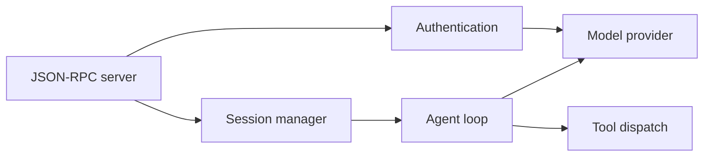
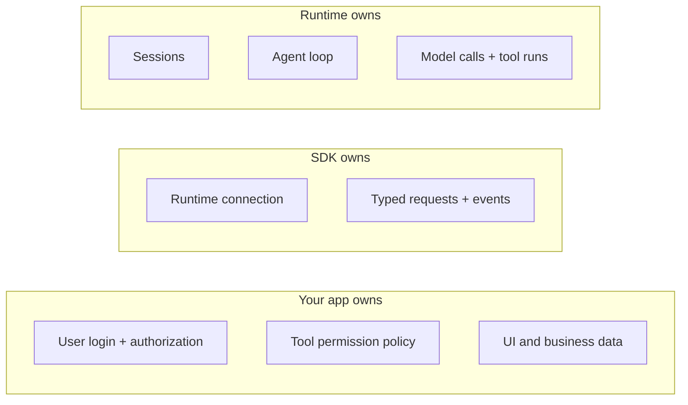
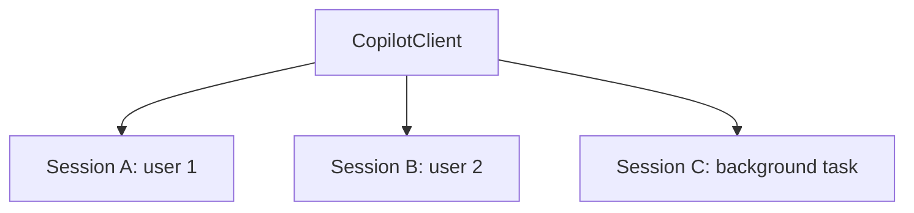
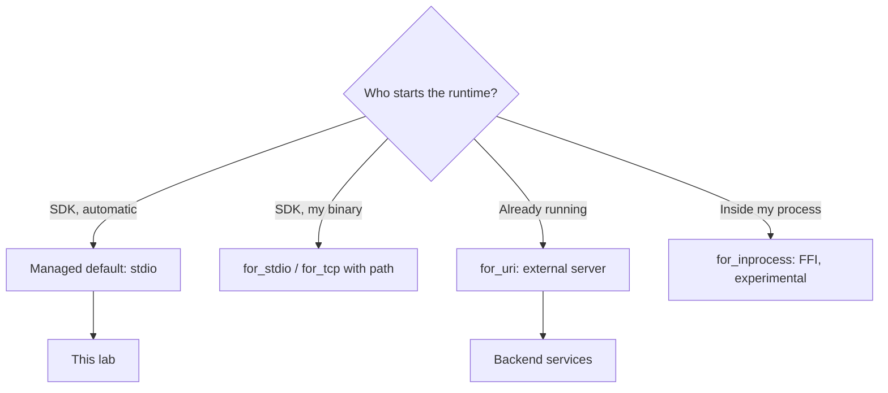
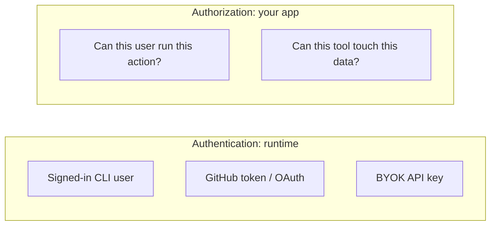

# Copilot SDK Architecture: More Views

Extra views. We update or delete these as we learn.
Start with [sdk-architecture.md](sdk-architecture.md).

## A. Inside the runtime

## B. Who owns what

## C. One client, many sessions

Keep users in separate sessions. Do not share context.

## D. Where the runtime runs (Python)

## E. Authentication vs authorization

- Authentication = how the runtime gets model access.
- Authorization = what your user may do. You build this.
