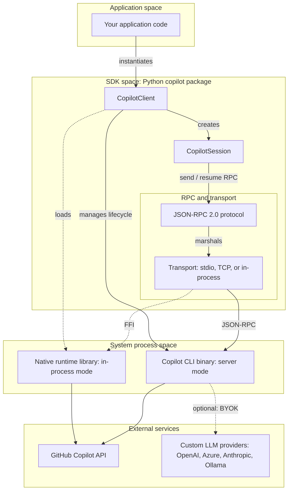
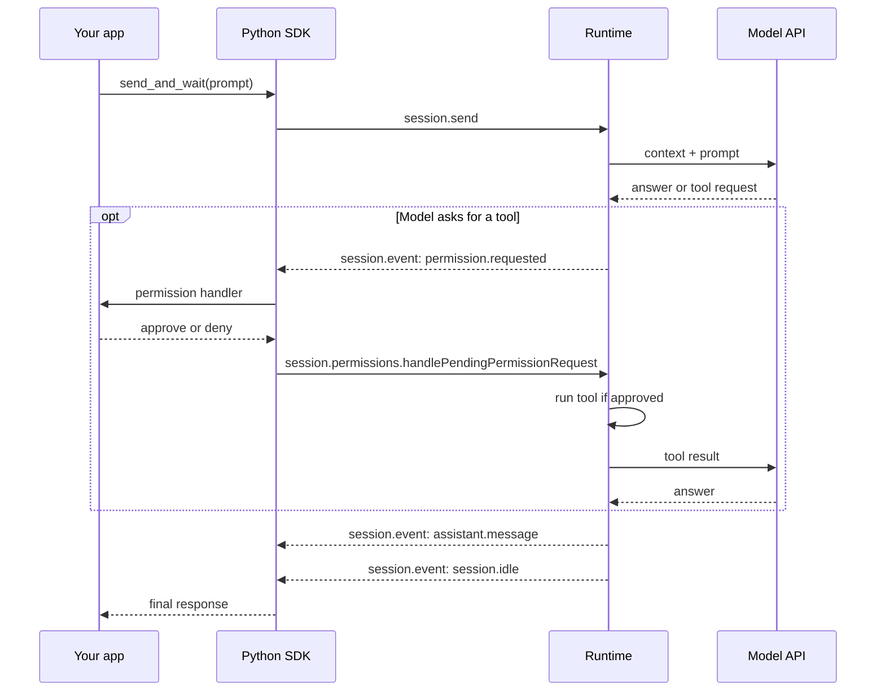

# Copilot SDK Architecture

## 1. The story

- Your app is the **manager**.
- The runtime is the **worker**.
- The SDK is the **phone line** between them.

## 2. SDK communication architecture

Adapted from [DeepWiki](https://deepwiki.com/github/copilot-sdk/1-overview). Checked against the installed Python SDK.

How to read it, top to bottom:

1. Your code creates a `CopilotClient`. The client creates `CopilotSession` objects.
2. A session sends JSON-RPC 2.0 messages. The transport carries them.
3. Default path: the client starts the CLI binary and talks over stdio. Solid arrows.
4. Experimental path: the client loads `runtime.node` into your process with FFI (`ctypes`). Dotted arrows.
5. The runtime calls GitHub Copilot API. With BYOK, it calls your own provider instead.

Events come back the same path, in reverse. Section 3 shows them.

## 3. One request, end to end

Key rule: **your app decides permission, not the model.**

## 4. Wire messages

| Direction | Message | Purpose |
|---|---|---|
| SDK → runtime | `session.create` | Make a session |
| SDK → runtime | `session.send` | Send a prompt |
| Runtime → SDK | `session.event` | All events: text, tools, idle, errors |
| SDK → runtime | `session.permissions.handlePendingPermissionRequest` | Reply: approve or deny |
| SDK → runtime | `session.tools.handlePendingToolCall` | Reply: custom tool result |

Verified in the installed SDK: `copilot/client.py`, `copilot/session.py`, `copilot/generated/rpc.py`.

## 5. Remember

| Term | Meaning |
|---|---|
| Client | Connection to the runtime |
| Session | One live agent workspace |
| Runtime | The agent engine |
| Event | A status report from the runtime |
| Tool | A capability the agent can use |
| Permission handler | Your safety gate |

More views (deployment, auth, sessions): [sdk-architecture-views.md](sdk-architecture-views.md).

## Sources

- [Setup paths and architecture](https://github.com/github/copilot-sdk/blob/main/docs/setup/choosing-a-setup-path.md)
- [Python SDK README](https://github.com/github/copilot-sdk/blob/main/python/README.md)
- [Getting started](https://github.com/github/copilot-sdk/blob/main/docs/getting-started.md)
- [DeepWiki overview](https://deepwiki.com/github/copilot-sdk/1-overview) (inspiration; may lag the repo)
