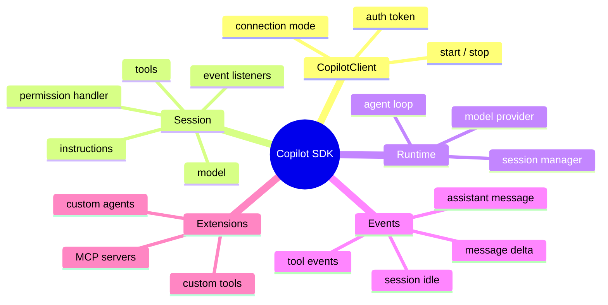
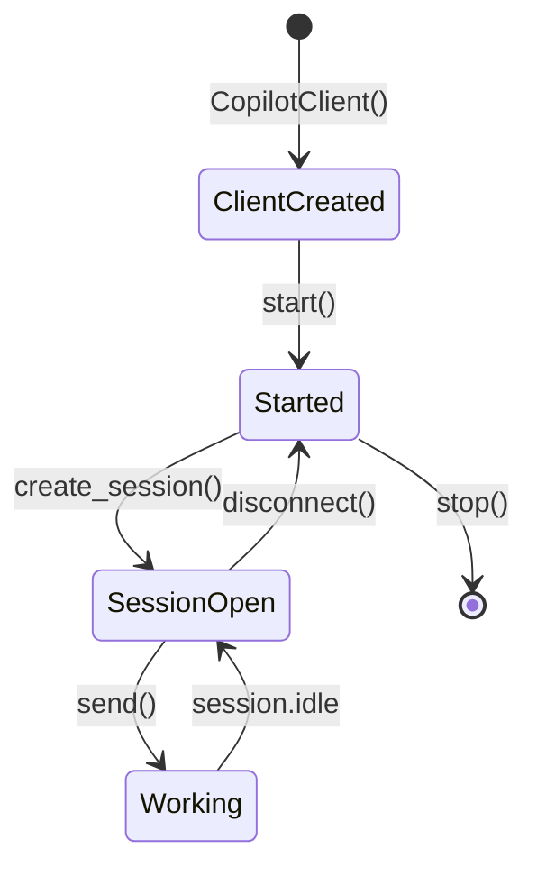
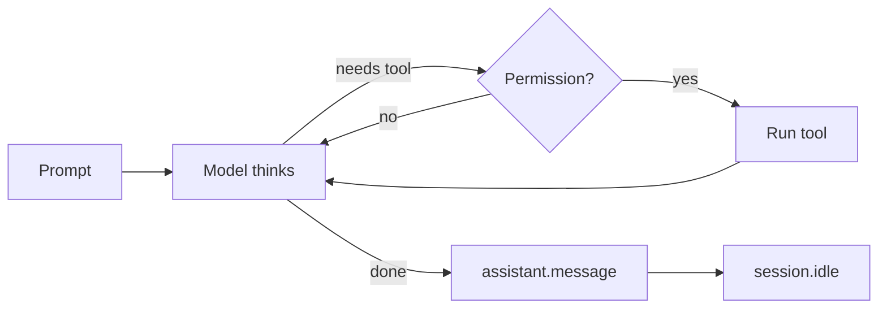
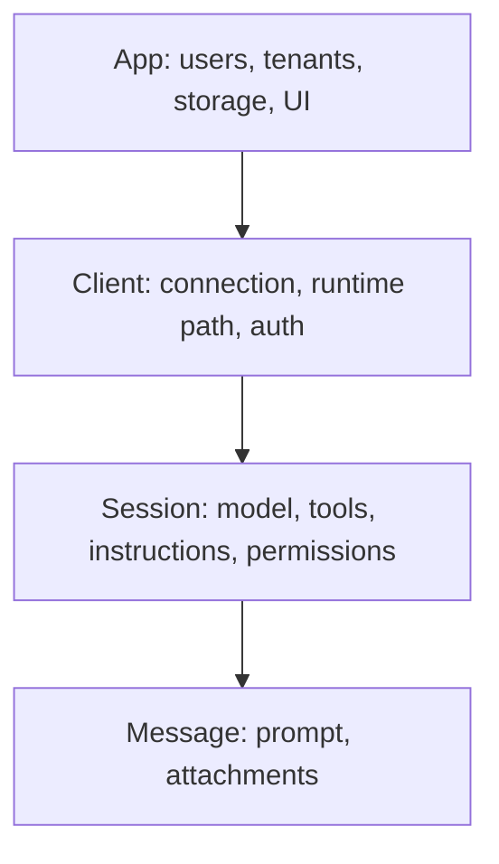
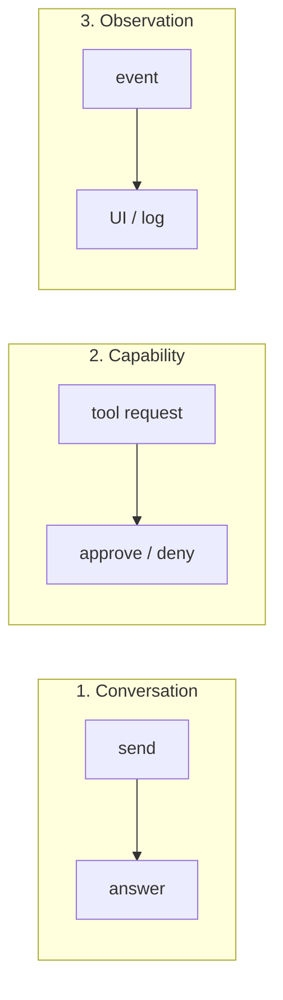

# Copilot SDK Components

Read [sdk-architecture.md](sdk-architecture.md) first.

## 1. Component map

## 2. Lifecycle

`async with` runs `start/stop` and `disconnect` for you.

## 3. One agent turn

A turn can loop many times before `session.idle`.

## 4. Configuration layers

Top layers live longer. Bottom layers change more often.

## 5. Three loops

When a problem occurs, ask: which loop is it?

## 6. Quick reference

| Component | One line |
|---|---|
| `CopilotClient` | Opens the line to the runtime |
| Runtime | Runs the agent |
| JSON-RPC | Message format on the line |
| Session | One agent workspace |
| Event | A status report |
| Tool | Something the agent can do |
| Permission handler | Says yes or no to tools |
| Custom agent | A specialist inside a session |

## Sources

- [Python SDK README](https://github.com/github/copilot-sdk/blob/main/python/README.md)
- [Getting started](https://github.com/github/copilot-sdk/blob/main/docs/getting-started.md)
