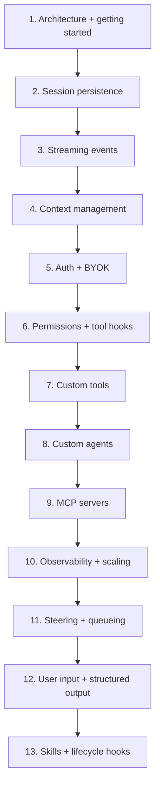
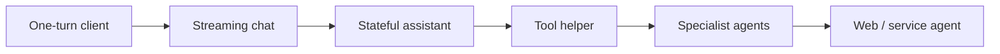
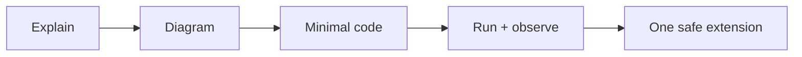

# Copilot SDK Learning Map

Breadth first. Depth later.

## 1. Concept path

## 2. Build path

| Build | Proves |
|---|---|
| One-turn client | Lifecycle works |
| Streaming chat | Events work |
| Stateful assistant | Context persists |
| Tool helper | Tools + permissions work |
| Specialist agents | Delegation works |
| Web / service agent | Identity + operations work |

## 3. How we learn each concept

Rule: no tools, agents, or UI until lifecycle and events are clear.

## 4. Progress

- [x] 1. Architecture ([doc](sdk-architecture.md)) + getting started ([lesson](lessons/lesson-01-getting-started.md)) (+ [scenario: Order 1000](scenario-checkout-order-1000.md))
- [x] 2. Session persistence ([lesson](lessons/lesson-02-session-persistence.md))
- [x] 3. Streaming events ([lesson](lessons/lesson-03-streaming-events.md))
- [x] 4. Context management ([lesson](lessons/lesson-04-context-management.md))
- [x] 5. Authentication + BYOK ([lesson](lessons/lesson-05-auth-and-byok.md))
- [x] 6. Permissions + tool hooks ([lesson](lessons/lesson-06-permissions-and-tool-hooks.md))
- [x] 7. Custom tools ([lesson](lessons/lesson-07-custom-tools.md))
- [x] 8. Custom agents ([lesson](lessons/lesson-08-custom-agents.md))
- [x] 9. MCP servers ([lesson](lessons/lesson-09-mcp-servers.md))
- [x] 10. Observability + scaling ([lesson](lessons/lesson-10-observability-and-scaling.md))
- [x] 11. Steering + queueing ([lesson](lessons/lesson-11-steering-and-queueing.md))
- [x] 12. User input + structured output ([lesson](lessons/lesson-12-user-input-and-structured-output.md))
- [x] 13. Skills + lifecycle hooks ([lesson](lessons/lesson-13-skills-and-lifecycle-hooks.md))
- [ ] Background features + 1.0.17 upgrade: **deferred until the SDK is GA** (see section 5)
- [x] Capstone: build the Order 1000 investigation app with all concepts (local Docker Compose; see [capstone.md](capstone.md))
- [ ] Capstone later: move the agent to Foundry Hosted Agents (**back burner**, decided 2026-10-05)

Coverage against the official docs: [sdk-coverage.md](sdk-coverage.md)

## 5. Deferred until SDK GA

> **Decision (2026-10-05):** the SDK is in public preview, so we do not upgrade or add preview features now. When the SDK reaches GA: run the `sdk-upgrade-check` skill, upgrade (1.0.17 adds sub-agent hooks and `session.set_tools`; sub-agent hooks could replace the capstone's stop-gate workaround), then add the features below as "Try it" steps and decide which ones the capstone uses.
>
> These features exist in our installed SDK (1.0.16) but no lesson runs them yet. Each lesson has them as background "Try it later" notes.

| Feature | What it does | Lesson note |
|---|---|---|
| `send_and_wait_typed(prompt, Model)` | Returns a validated Pydantic object directly | [Lesson 12](lessons/lesson-12-user-input-and-structured-output.md#later-background-features) |
| `ask_user_variant="elicitation"` + `on_elicitation_request` | `ask_user` as a structured form | [Lesson 12](lessons/lesson-12-user-input-and-structured-output.md#later-background-features) |
| `AgentMessageSource` (`send(..., source=...)`) | Labels who sent a message: user, system, or an agent | [Lesson 8](lessons/lesson-08-custom-agents.md#later-background-features) |
| `session.set_auto_tier("fast")` | Routing tier for `model="auto"` | [Lesson 5](lessons/lesson-05-auth-and-byok.md#later-background-features) |
| `installation_confirmation_handler` (client) | Human review before an MCP server or skill is installed | [Lesson 9](lessons/lesson-09-mcp-servers.md#later-background-features) |
